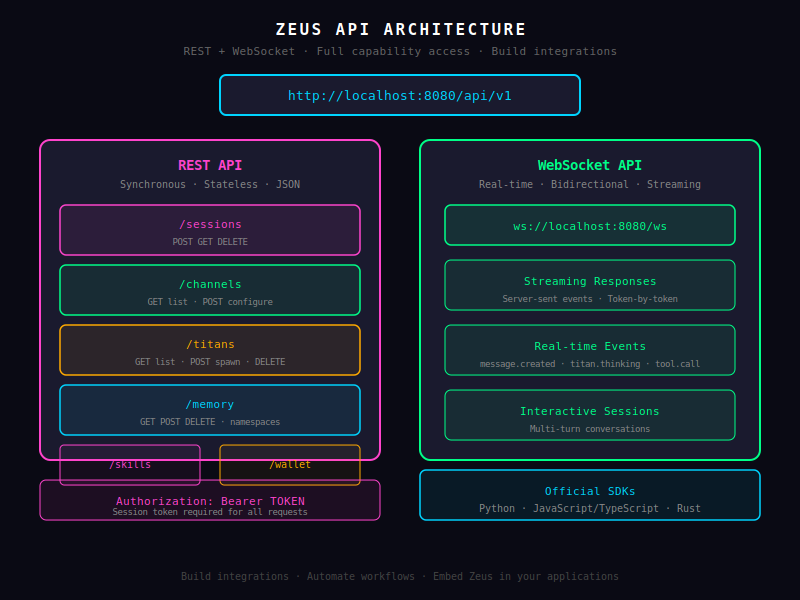

# API Reference

*The next generation of Sentient AI entities. The Titans. The future is here.*

---

Zeus exposes a full REST + WebSocket API. Every capability in the TUI and Web UI is available via API — build integrations, automate workflows, or embed Zeus in your own applications.

---



## Base URL

```bash
http://localhost:8080/api/v1
```

All endpoints are prefixed with `/api/v1`.

---

## Authentication

All API requests require a session token in the `Authorization` header:

```bash
curl -H "Authorization: Bearer YOUR_SESSION_TOKEN" \
     http://localhost:8080/api/v1/status
```

Generate a session token via the `/auth/login` endpoint or in the Web UI.

---

## Sessions

| Method | Endpoint | Description |
|--------|----------|-------------|
| `POST` | `/sessions` | Create a new session |
| `GET` | `/sessions` | List all sessions |
| `GET` | `/sessions/:id` | Get session details |
| `DELETE` | `/sessions/:id` | Delete a session |
| `POST` | `/sessions/:id/messages` | Send a message |
| `GET` | `/sessions/:id/messages` | Get conversation history |

---

## Channels

| Method | Endpoint | Description |
|--------|----------|-------------|
| `GET` | `/channels` | List configured channels |
| `GET` | `/channels/:name` | Channel details |
| `POST` | `/channels/:name/test` | Test channel connection |
| `PUT` | `/channels/:name/config` | Update channel config |

---

## Tools

| Method | Endpoint | Description |
|--------|----------|-------------|
| `GET` | `/tools` | List all available tools (212 total) |
| `GET` | `/tools/:name` | Tool schema and description |
| `POST` | `/tools/execute` | Execute a tool directly |
| `GET` | `/tools/stats` | Usage statistics |

---

## Memory

| Method | Endpoint | Description |
|--------|----------|-------------|
| `GET` | `/memory` | Query memory (semantic search) |
| `POST` | `/memory` | Store a memory entry |
| `GET` | `/memory/stats` | Memory usage stats |
| `DELETE` | `/memory/:id` | Delete a memory entry |
| `POST` | `/memory/vectorize` | Vectorize and index content |

---

## Agents

| Method | Endpoint | Description |
|--------|----------|-------------|
| `GET` | `/agents` | List all Titans |
| `GET` | `/agents/:name` | Agent details and status |
| `POST` | `/agents/:name/invoke` | Invoke an agent directly |
| `GET` | `/agents/:name/tools` | List agent's available tools |
| `PUT` | `/agents/:name/config` | Update agent configuration |

---

## Pantheon

| Method | Endpoint | Description |
|--------|----------|-------------|
| `POST` | `/pantheon/war-rooms` | Create a war room |
| `GET` | `/pantheon/war-rooms` | List active war rooms |
| `GET` | `/pantheon/war-rooms/:id` | War room details |
| `POST` | `/pantheon/war-rooms/:id/agents` | Add agent to war room |
| `POST` | `/pantheon/missions` | Create a mission |
| `GET` | `/pantheon/missions/:id` | Mission status |
| `POST` | `/pantheon/missions/:id/pause` | Pause mission |
| `POST` | `/pantheon/missions/:id/cancel` | Cancel mission |
| `POST` | `/pantheon/missions/:id/redirect` | Redirect mission |

---

## Skills

| Method | Endpoint | Description |
|--------|----------|-------------|
| `GET` | `/skills` | List installed skills |
| `POST` | `/skills/install` | Install a skill |
| `DELETE` | `/skills/:name` | Remove a skill |
| `GET` | `/skills/:name` | Skill details |
| `PUT` | `/skills/:name/activate` | Activate skill for agent |

---

## Network

| Method | Endpoint | Description |
|--------|----------|-------------|
| `GET` | `/network/peers` | List connected peers |
| `POST` | `/network/connect` | Connect to a peer |
| `DELETE` | `/network/peers/:id` | Disconnect peer |
| `GET` | `/network/agents` | Discover agents on network |

---

## Analytics

| Method | Endpoint | Description |
|--------|----------|-------------|
| `GET` | `/analytics/usage` | Token and API usage |
| `GET` | `/analytics/tools` | Tool usage breakdown |
| `GET` | `/analytics/channels` | Channel activity |
| `GET` | `/analytics/agents` | Per-agent metrics |

---

## Security

| Method | Endpoint | Description |
|--------|----------|-------------|
| `GET` | `/security/events` | Recent security events |
| `GET` | `/security/rate-limits` | Rate limit status |
| `POST` | `/security/block` | Block a user/channel |
| `DELETE` | `/security/block/:id` | Unblock |

---

## Approvals

| Method | Endpoint | Description |
|--------|----------|-------------|
| `GET` | `/approvals/pending` | Pending approval requests |
| `POST` | `/approvals/:id/approve` | Approve a request |
| `POST` | `/approvals/:id/reject` | Reject a request |

---

## Webhooks

| Method | Endpoint | Description |
|--------|----------|-------------|
| `GET` | `/webhooks` | List webhooks |
| `POST` | `/webhooks` | Create a webhook |
| `DELETE` | `/webhooks/:id` | Delete a webhook |
| `GET` | `/webhooks/:id/events` | Webhook delivery history |

---

## WebSocket

For real-time updates, connect to the WebSocket endpoint:

```bash
ws://localhost:8080/api/v1/ws
```

**Subscribe to events:**
```json
{"action": "subscribe", "channel": "sessions"}
{"action": "subscribe", "channel": "pantheon"}
{"action": "subscribe", "channel": "security"}
```

**Receive events:**
```json
{"event": "session.updated", "data": {"id": "...", "status": "active"}}
{"event": "pantheon.mission.completed", "data": {"mission_id": "...", "result": "..."}}
{"event": "security.threat.detected", "data": {"type": "injection", "channel": "discord"}}
```

---

## Rate Limits

| Endpoint Category | Limit |
|---|---|
| General API | 120 requests/minute |
| Tool execution | 50 tool calls/minute |
| Message send | 60 messages/minute |
| WebSocket | 30 subscriptions |
| Bulk operations | 10 requests/minute |

Rate limits are per-session by default. Configure per-channel limits in `config.toml`.

---

## Error Responses

All errors return a JSON body:

```json
{
  "error": {
    "code": "TOOL_NOT_FOUND",
    "message": "Tool 'github-nonexistent' not found",
    "details": {
      "tool_name": "github-nonexistent",
      "available_tools": 212
    }
  }
}
```

**Common error codes:**

| Code | HTTP Status | Description |
|------|-------------|-------------|
| `UNAUTHORIZED` | 401 | Invalid or missing session token |
| `FORBIDDEN` | 403 | Insufficient permissions |
| `NOT_FOUND` | 404 | Resource doesn't exist |
| `RATE_LIMITED` | 429 | Too many requests |
| `TOOL_NOT_FOUND` | 404 | Tool doesn't exist |
| `AGENT_UNAVAILABLE` | 503 | Agent is offline |
| `INVALID_REQUEST` | 400 | Malformed request body |

---

## SDKs

Community-built SDKs for common languages:

```bash
# Python
pip install zeus-sdk

# JavaScript/TypeScript
npm install @zeuslabai/sdk

# Rust
cargo add zeus-sdk
```

Full SDK documentation at: https://github.com/zeuslabai/zeus-sdk

---

**Previous:** [Agora →](agora.md)
