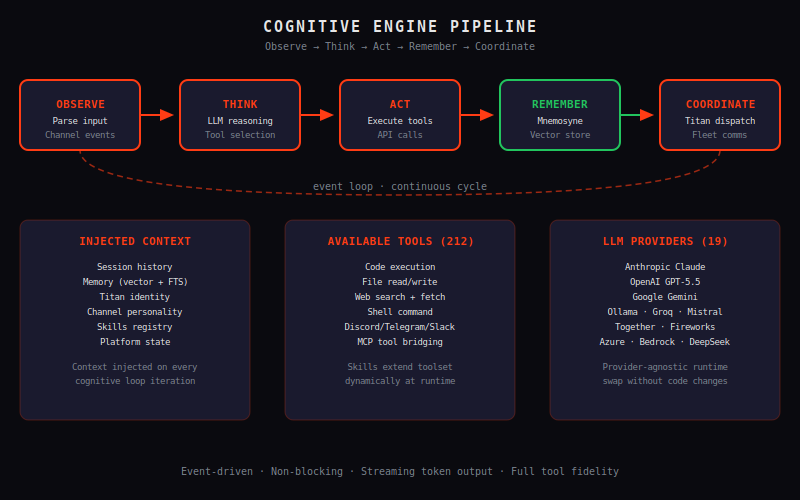

# Architecture — How Zeus Thinks and Acts

Zeus is not a simple chatbot wrapper. Under the hood lies a sophisticated cognitive architecture designed for autonomous operation at scale — a system that observes, reasons, acts, remembers, and coordinates across multiple intelligent agents. This document provides a comprehensive technical tour of that architecture, from the cognitive engine at Zeus's core to the distributed deployment topology that keeps everything running.

## 1. The Cognitive Engine (Zeus Core)

The Cognitive Engine is the brain of Zeus — a lightweight, event-driven runtime that orchestrates the entire intelligence pipeline. Unlike monolithic AI systems that lump everything into a single opaque process, Zeus Core is deliberately decomposed into well-defined stages: **Observe → Think → Act → Remember → Coordinate**. Each stage has clear inputs, outputs, and failure modes, making the system debuggable, extensible, and predictable.

### Event-Driven Runtime

Zeus Core operates as an event loop at heart. Incoming stimuli — user messages, API calls, tool responses, scheduled triggers, external webhooks — are normalized into a unified event stream. These events flow through the pipeline:

- **Observe**: Raw input is parsed, sanitized, and enriched with context metadata (sender identity, channel, timestamp, session state). The system determines intent and routes the event to the appropriate handler.
- **Think**: The enriched event is passed to the LLM provider (or chain of providers) along with the current memory context, tool registry, and active skill prompts. The model produces a structured response: text, tool calls, or multi-step plan.
- **Act**: Tool calls are validated against Aegis permissions, executed in the sandboxed environment, and their results fed back into the Think stage for synthesis. Text responses are rendered and dispatched to output channels.
- **Remember**: Finalized interactions are stored in Mnemosyne with appropriate memory types and embeddings. Learned facts, skills, and patterns are consolidated for future recall.
- **Coordinate**: High-level events (multi-agent tasks, system alerts, state changes) are broadcast to all connected Titans via the internal message bus, ensuring the fleet remains synchronized.

This loop runs continuously, processing thousands of events per second on capable hardware. The event-driven model means the system naturally handles concurrent users, asynchronous tool execution, and real-time streaming without the complexity of thread-per-request architectures.

### Provider Freedom: Any LLM

One of Zeus's defining architectural decisions is **provider freedom** — the system is not locked into any single AI provider. As long as a model speaks the OpenAI-compatible API (or has an adapter written for it), Zeus can use it. This includes:

- **Minimax** — Excellent cost-performance ratio, particularly for high-volume workloads
- **Claude (Anthropic)** — Best-in-class reasoning and instruction following
- **GPT-4 / GPT-4o (OpenAI)** — Versatile general intelligence with strong tool use
- **Gemini (Google)** — Strong multimodal capabilities and long context windows
- **Grok (xAI)** — Real-time knowledge and distinctive personality
- **Local models** — Llama, Mistral, Command R via Ollama or LM Studio

The provider abstraction is deep, not surface-level. Zeus does not just forward prompts — it maintains per-provider cost tracking, latency profiles, token budgets, and quality benchmarks. This enables intelligent, automatic provider selection based on the task at hand.

### Model Router with Fallback Chains

The **Model Router** is a critical component of Zeus Core. When a request arrives, the router evaluates the task characteristics — complexity, required domain expertise, latency tolerance, cost budget — and selects the optimal provider. The router supports:

- **Fallback chains**: If the primary model fails (rate limit, API error, timeout), Zeus automatically escalates to the next provider in the chain. A complex reasoning task might try GPT-4o first, fall back to Claude if rate-limited, and finally to a local Llama instance if all cloud providers fail.
- **Cost weighting**: Zeus tracks cumulative token spend per provider and can balance load to stay within budget constraints. Expensive frontier models are reserved for tasks that genuinely require them.
- **Latency optimization**: For interactive use cases, the router can select the fastest available provider rather than the cheapest or most capable. Background tasks can afford higher latency for cost savings.
- **Quality routing**: Simple factual queries go to fast, cheap models. Complex multi-step reasoning goes to frontier models. Code generation goes to specialized code models.

Fallback chains are fully configurable per-Titan and per-skill, so different agents in your fleet can use entirely different routing strategies.

### Prompt Compilation and Caching

Every prompt that leaves Zeus Core goes through a **Prompt Compiler** first. The compiler takes a template (defined in a SKILL.md or the Titan's base prompt), injects dynamic context (memory recall, tool descriptions, conversation history), resolves variables, and produces a final prompt ready for the model. This compilation step enables:

- **Template reuse**: Skills define prompts once, use them everywhere. Variables like `{user_name}`, `{current_date}`, `{relevant_memory}` are resolved at runtime.
- **Prompt optimization**: The compiler can apply techniques like chain-of-thought wrapping, few-shot example injection, and system prompt compression.
- **Semantic caching**: Compiled prompts are hashed and checked against a semantic cache. If an identical (or semantically equivalent) prompt was recently executed, Zeus returns the cached response instantly — no API call, no latency, no cost.

The cache uses both exact-match and embedding-based similarity to maximize hit rates while minimizing false positives.

### Long-Term Memory via Mnemosyne Integration

Zeus Core is tightly integrated with **Mnemosyne**, Zeus's persistent memory system. At every Remember step, the Cognitive Engine decides what to store, how to embed it, and which memory type to use. Before every Think step, it queries Mnemosyne for relevant context to inject into the prompt.

This tight coupling means that every Titan in your fleet benefits from the collective intelligence of all previous interactions. A Titan that learns a user's preferred communication style during one session will apply that knowledge in the next session — even after a restart. Mnemosyne is covered in detail in its own documentation chapter.

## 2. Titan Coordination

Zeus is built for scale. A single Zeus instance can handle substantial workloads, but the architecture shines when you deploy multiple **Titans** — independent agents that collaborate, specialize, and coordinate to tackle complex problems.

### Independent Agents with Own Resources

Each **Titan** is a first-class citizen in the Zeus ecosystem. It has:

- **Own base prompt**: Defining its role, personality, and behavioral boundaries
- **Own tool set**: A subset of the global tool registry, scoped by Aegis permissions
- **Own memory namespace**: Private semantic, episodic, and procedural memory
- **Own skill library**: Loaded from local SKILL.md files or shared via the Pantheon
- **Own event stream**: Subscribed to relevant events, filtering what it cares about

Titans can be specialized — one for DevOps tasks, one for customer support, one for code review — or they can be generic replicas handling load distribution. Either way, each Titan operates independently, making the system resilient to individual failures.

### Zeus Core Orchestration via Message Bus

Titans do not communicate directly with each other — they communicate through the **internal message bus**. This bus is the nervous system of the Zeus fleet:

- Titans publish events (task completions, findings, requests for help)
- Titans subscribe to event patterns (relevant topics, keywords, priority levels)
- Zeus Core acts as the bus operator, routing messages, enforcing permissions, and maintaining delivery guarantees

The message bus supports both point-to-point messaging (one Titan to another) and pub/sub patterns (broadcasting to all interested subscribers). Messages are persistent, so if a Titan is temporarily offline, it will receive missed messages when it reconnects.

### Pantheon for Multi-Agent Collaboration

When a task is too complex for a single Titan, **Pantheon** kicks in. Pantheon is the multi-agent collaboration layer — a supervisor that decomposes a high-level goal into sub-tasks, assigns them to appropriate Titans, manages dependencies, and synthesizes the results.

For example, a user asking "Set up my entire development environment" might be decomposed by Pantheon into: provision the VM (DevOps Titan), install dependencies (Setup Titan), configure CI/CD (Pipeline Titan), and write initial tests (QA Titan). Pantheon orchestrates the parallel execution, handles failures, and produces a unified response.

Pantheon supports several collaboration patterns: sequential (tasks complete in dependency order), parallel (independent tasks run simultaneously), hierarchical (a supervisor Titan delegates to workers and aggregates results), and debate (multiple Titans propose solutions and Pantheon selects the best).

### Real-Time Event Streaming

Every Titan maintains a WebSocket connection to Zeus Core for **real-time event streaming**. This means:

- Titans receive updates instantly, not on the next polling cycle
- System operators can subscribe to the event stream for live monitoring
- New Titans can join the fleet and receive current state within milliseconds
- Heartbeats ensure the system detects and recovers from crashed Titans automatically

The event stream is also exposed externally via the API, allowing external systems (monitoring dashboards, webhooks, other Zeus instances) to subscribe and react to fleet events.

## 3. Capability System

Zeus's capabilities are not hardcoded — they are loaded, discovered, and managed through a layered extension system that lets you customize behavior without forking the core.

### Skills Loaded from SKILL.md Files

A **Skill** is the fundamental unit of capability in Zeus. Skills are defined in `SKILL.md` files that live alongside your Zeus configuration or in shared skill repositories. A SKILL.md file contains:

- **Name and version**: Identifying the skill uniquely
- **Description**: What the skill does, when to use it
- **Trigger conditions**: Patterns, keywords, or intent classifiers that activate the skill
- **Prompt template**: The system prompt or user-facing template the skill uses
- **Tool definitions**: The tools this skill can invoke
- **Configuration schema**: Parameters the skill accepts

The `zeus-skill` system automatically discovers skills at startup and on hot-reload. You can install skills from the community skill registry, write your own, or share them within your organization. Skills can depend on other skills, enabling composition and reuse.

### OpenClaw Plugin Architecture

Beyond skills, **OpenClaw** provides a deep plugin architecture for extending Zeus at the code level. OpenClaw plugins can:

- Add new API routes to any subsystem
- Implement new tool types beyond the built-in library
- Hook into the event lifecycle (pre-process events, post-process responses)
- Replace core components (custom model adapters, storage backends, channel integrations)
- Add new memory types or modify the recall algorithm

OpenClaw plugins are compiled WASM modules that run in an isolated environment, giving you the extensibility of native code without the risk of destabilizing the core daemon.

### WASM Sandbox for Untrusted Code

Speaking of which: **zeus-sandbox** is Zeus's WASM-based runtime for executing untrusted or external code. Any tool, skill, or plugin that runs user-supplied code does so inside a zeus-sandbox instance. The sandbox:

- Provides zero syscall access by default (no filesystem, no network, no process creation)
- Grants capabilities explicitly (read from a specific directory, write to a temp location)
- Enforces memory limits and execution timeouts
- Is verifiable — the WASM module can be audited before loading

This means you can safely run community plugins, untrusted skills, or experimental code without compromising the security of your Zeus deployment.

### Tool Registry with Permission Scoping

The **Tool Registry** is the central catalog of everything Zeus can do. Every tool has:

- **Name and namespace**: Globally unique identifier
- **Input/output schema**: JSON Schema for validation
- **Permission requirement**: What Aegis permission is needed to invoke it
- **Resource cost**: Token budget, execution time limits
- **Rate limits**: Per-user, per-Titan, or global

Tools are scoped to Titans — a DevOps Titan might have access to shell commands and cloud APIs, while a Support Titan only has access to knowledge base queries and email tools. This scoping is enforced by Aegis at the request level.

## 4. API Layer

Zeus exposes a comprehensive REST API — 267 routes across all subsystems — giving you programmatic control over every aspect of the platform.

### REST Routes Across All Subsystems

The API is organized into resource-based subsystems:

- **/v1/titans** — Titan lifecycle management (create, configure, monitor, terminate)
- **/v1/skills** — Skill registry operations (install, update, remove, activate)
- **/v1/memory** — Mnemosyne memory operations (store, search, retrieve, delete)
- **/v1/channels** — Channel configuration and message operations
- **/v1/tools** — Tool registry and permission management
- **/v1/pantheron** — Multi-agent mission creation and tracking
- **/v1/events** — Event stream subscriptions and history
- **/v1/system** — Health checks, metrics, configuration

Every route supports standard CRUD operations, bulk operations for efficiency, and batch endpoints for high-throughput scenarios.

### Full OpenAPI Specification

The complete API surface is documented with a live **OpenAPI 3.1 specification** available at `/swagger-ui`. This interactive documentation lets you explore every endpoint, execute API calls directly from the browser, generate client libraries in your language of choice, and validate integrations against the spec. The spec is auto-generated from the codebase, ensuring it is always current.

## 5. Deployment Topology

For real-time use cases, the API offers WebSocket endpoints that mirror the REST routes but push data as it happens. WebSockets are used for:

- Live event streams from the fleet
- Streaming LLM responses (token-by-token as they are generated)
- Real-time tool output (long-running commands streamed back)
- Interactive dashboards pulling live metrics

The WebSocket layer maintains connection state, handles reconnection gracefully, and multiplexes multiple subscriptions over a single connection.

### Security: Bearer Token, Rate Limiting, Circuit Breakers

The API enforces security at every layer:

- **Bearer token authentication**: Every request must include a valid `Authorization: Bearer <token>` header. Tokens are scoped (read-only, read-write, admin) and can be revoked instantly.
- **Rate limiting**: Per-token rate limits prevent abuse. Configurable windows (per-second, per-minute, per-day) with automatic retry-after headers.
- **Circuit breakers**: When a downstream service (LLM provider, external API) is failing, the circuit breaker trips and returns cached/fallback responses instead of hammering the failing service. This protects the entire fleet from cascading failures.

### WebSocket Support for Real-Time Streaming

Zeus is designed for self-hosted deployment. There is no Zeus cloud, no mandatory online account, and no data leaving your infrastructure unless you explicitly configure it to.

### Daemon as launchd or systemd

The Zeus daemon runs natively on your platform:

- **macOS**: Managed by `launchd`, integrated with the system's service management. Install via the Homebrew formula and the daemon starts automatically at login.
- **Linux / FreeBSD**: Managed by `systemd`, with a properly installed service unit. Start, stop, restart, and check status with standard systemctl commands.
- **Windows**: Runs as a Windows Service, managed via sc.exe or the Services MMC snap-in.

The daemon is the single process that runs Zeus. Everything — the Cognitive Engine, Titan coordination, API server, WebSocket handler, skill loader — runs within this process or its supervised child processes.

### Config-Guard: Hot-Reload Configuration

**Config-guard** watches the `config.toml` file and automatically applies changes without requiring a full restart. Changes to:

- Titan configurations
- API settings
- Memory parameters
- Channel credentials
- Skill activations

...are detected within seconds and applied atomically. If a configuration change is invalid, Config-guard logs the error and keeps the previous valid configuration active, preventing the daemon from entering a broken state.

### Tailscale API for Zero-Config Networking

Zeus supports **Tailscale** integration for seamless networking between distributed Zeus nodes. With Tailscale:

- Every Zeus node gets a stable identity on a virtual network
- Nodes discover each other automatically via DERP relays
- All traffic is encrypted end-to-end with WireGuard
- No port forwarding, no dynamic DNS, no VPN configuration needed

This makes multi-node Zeus deployments trivial — spin up a new node, add it to your Tailscale network, and it joins the fleet automatically.

### Fully Self-Hosted, No Cloud Dependency

Every component of Zeus — the Cognitive Engine, memory system, API layer, skill loader, tool registry, and channel integrations — runs on your infrastructure. The only optional external dependency is the LLM provider's API (which you pay for directly, with no Zeus markup). Your prompts, your Titan configurations, your memory data, your channel credentials — none of it ever touches Zeus's infrastructure because there is no Zeus infrastructure. It is yours, on your machines, under your control.

This is not a constraint — it is an architectural commitment. Self-hosting means predictable latency (no round-trips to a third-party gateway), predictable costs (pay for compute and tokens, nothing else), and regulatory compliance (data never leaves your jurisdiction). For enterprises with strict security requirements, government agencies, and privacy-conscious organizations, this is not optional — it is table stakes.
