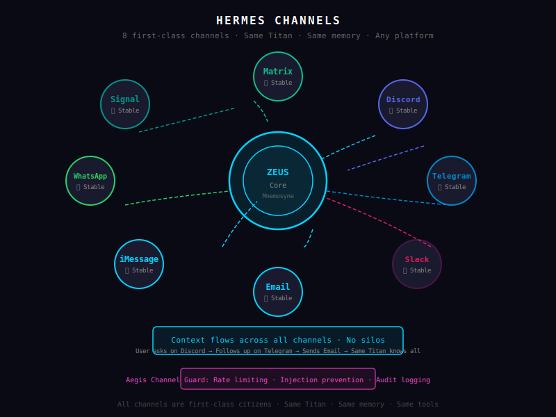

# Channels

*The next generation of Sentient AI entities. The Titans. The future is here.*

---

Hermes connects Zeus to the outside world. Each channel is a first-class citizen — your Discord users talk to the same Titans as your Telegram users, with full context preserved across all channels.

---



## Supported Channels

| Channel | Status | Protocol | Notes |
|---|---|---|---|
| **Discord** | ✅ Stable | WebSocket (gateway) + REST API | Guilds, threads, slash commands |
| **Telegram** | ✅ Stable | Bot API (webhooks/polling) | Groups, channels, inline queries |
| **Slack** | ✅ Stable | Slack API (webhooks/RTM) | Workspaces, channels, shortcuts |
| **Email** | ✅ Stable | IMAP/SMTP | Threading, attachments |
| **iMessage** | ✅ Stable | iTerm + AppleScript | Direct messages on macOS |
| **WhatsApp** | ✅ Stable | WhatsApp Business API | Business accounts |
| **Signal** | ✅ Stable | Signal Messenger API | Signal numbers |
| **Matrix** | ✅ Stable | Matrix protocol | Federation, E2EE support |

All 8 channels are first-class. Same Titan, same memory, same tools — regardless of where your users are.

---

## Discord

Discord is Zeus's most feature-rich channel. Supports:
- Guild-based organization
- Thread conversations
- Slash commands (`/zeus`, `/ask`, `/search`)
- Direct messages
- Webhook events (GitHub, Jenkins, etc.)
- Message reactions and threading

**Setup:**
```toml
[channels.discord]
enabled = true
token = "your-discord-bot-token"  # From Discord Developer Portal
guild_id = ""                    # Optional: restrict to specific guild
channel_ids = []                  # Optional: restrict to specific channels
```

**Slash commands registered by Zeus:**
- `/ask [question]` — Ask Zeus anything
- `/search [query]` — Semantic search across memory
- `/status` — Check Zeus system status
- `/skills list` — List available skills
- `/memory stats` — Show memory usage stats

---

## Telegram

Telegram bots are lightweight and powerful. Supports:
- Private and group chats
- Channel posts
- Inline queries (`@YourBot query`)
- Custom keyboards and callbacks
- Webhook or polling mode

**Setup:**
```toml
[channels.telegram]
enabled = true
bot_token = "123456:ABC-..."  # From @BotFather
```

**Commands:**
- `/start` — Begin conversation
- `/help` — Show help
- `/status` — System status
- `/search [query]` — Search memory

---

## Slack

Connect to your Slack workspace:
- Channel messages with `@Zeus`
- Slash commands
- Modal dialogs (interactive forms)
- App Home (persistent DM interface)
- Event subscriptions

**Setup:**
```toml
[channels.slack]
enabled = true
token = "xoxb-..."           # Bot token
signing_secret = "..."       # From Basic Information page
team_id = "T0123456789"     # Your workspace ID
```

**Permissions needed:**
- `chat:write`
- `commands`
- `app_mentions:read`
- `channels:history` (if reading channel history)

---

## Email

Email integration for professional environments:
- IMAP for reading
- SMTP for sending
- Thread tracking (in-reply-to headers)
- Attachment handling (download, store, forward)
- HTML and plain text support

**Setup:**
```toml
[channels.email]
enabled = true
imap_host = "imap.gmail.com"
imap_port = 993
imap_user = "zeus@yourdomain.com"
imap_password = "app-password-here"  # Use app password, not login password
smtp_host = "smtp.gmail.com"
smtp_port = 587
smtp_user = "zeus@yourdomain.com"
smtp_password = "app-password-here"
```

For Gmail: enable 2FA and generate an [app password](https://support.google.com/accounts/answer/185833).

---

## iMessage

macOS-only voice-first integration:
- Uses iTerm + AppleScript to send/receive iMessages
- Contacts app integration
- Group message support
- No additional accounts needed

**Setup:**
```toml
[channels.imessage]
enabled = true
# Requires macOS with iTerm installed and AppleScript enabled
# iMessage must be signed into your Apple ID in Messages.app
```

**Requirements:**
- macOS (required for AppleScript iMessage access)
- iTerm installed
- AppleScript access enabled in iTerm
- iMessage signed in on the Mac running Zeus

---

## WhatsApp

WhatsApp Business API integration:
- One-on-one conversations
- Business profile
- Template messages for outreach
- Read receipts and typing indicators

**Setup:**
```toml
[channels.whatsapp]
enabled = true
phone_number_id = "..."     # From WhatsApp Business API
access_token = "..."        # From Meta Developer Portal
business_account_id = "..." # Meta Business Account ID
```

**Requirements:**
- WhatsApp Business API access via Meta
- Verified business number
- Approved template messages (for outbound)

---

## Signal

Signal Messenger integration:
- Personal Signal number or linked number
- End-to-end encrypted
- Group messages
- No phone number masking

**Setup:**
```toml
[channels.signal]
enabled = true
signal_cli_path = "/usr/local/bin/signal-cli"
phone_number = "+1234567890"  # Your Signal number
```

**Requirements:**
- [signal-cli](https://github.com/AsamK/signal-cli) installed
- Signal number registered and linked

---

## Matrix

Federation-ready messaging:
- Connect to any Matrix homeserver
- End-to-end encryption (E2EE)
- Room federation across servers
- Bridge to other networks

**Setup:**
```toml
[channels.matrix]
enabled = true
homeserver_url = "https://matrix.org"
user_id = "@zeus:matrix.org"
access_token = "..."        # From Element or MSC3231 login
room_id = ""                # Optional: restrict to specific room
```

---

## Cross-Channel Context

The killer feature: **context flows across channels**.

Example:

1. User asks something on **Discord** → Titan researches, stores result in Mnemosyne
2. Same user asks a follow-up on **Telegram** → Titan retrieves context from Mnemosyne, continues seamlessly
3. User sends an email → Titan has full conversation history across all channels

No silos. No "I asked this on Discord but I need to repeat it on Telegram." Every Titan knows the full history.

---

## Channel Security

Each channel is protected by **Aegis Channel Guard**:
- Message sanitization (strip malicious payloads)
- Rate limiting per user per channel
- Sender verification
- Injection attack prevention
- Audit logging of all channel events

---

**Previous:** [Skills →](skills.md) · **Next:** [Agora →](agora.md)
