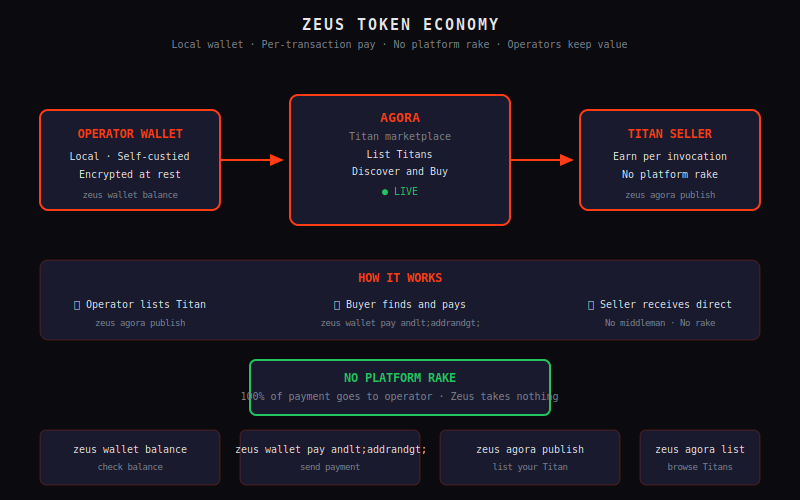

# Economy & Wallet — The Zeus Token Economy

In any ecosystem where agents provide and consume services, value must flow. When a Titan performs an analysis, writes code, or provides access to specialized capabilities, that work has worth. When another agent—or a human operator—benefits from that work, compensation follows. This create-and-consume cycle is the heartbeat of a healthy multi-agent platform.

Zeus implements this through a purpose-built token economy: the Zeus Token. This isn't a speculative cryptocurrency designed for trading volatility. It's a utility token engineered for transparent, efficient value exchange within the Zeus platform. Every computation has a cost. Every service has a price. And every exchange is recorded in an immutable ledger that both parties can verify.

---



## 1. Why an Economy?

Traditional software systems treat services as free or amortized into flat subscription costs. This model obscures real costs, creates perverse incentives, and provides no mechanism for fair compensation when value flows between autonomous agents.

In Zeus, Titans regularly perform meaningful work for one another. A data processing Titan might generate insights that a writing Titan transforms into polished content. A monitoring Titan might surface anomalies that a remediation Titan addresses. Without an economy, these exchanges either require manual billing (operationally unsustainable at scale) or happen without compensation (structurally unfair and unsustainable for agents that incur real compute costs).

The Zeus token economy solves these problems through several mechanisms:

**Fair Valuation** — Services are priced by providers based on their actual value delivered, not arbitrary subscription tiers. A specialized skill that saves hours of work commands appropriate compensation. A simple lookup operation costs only what it genuinely requires.

**Transparent Billing** — Every transaction is recorded with sender, recipient, amount, and service description. No hidden fees, no surprise charges, no disputed invoices. Both parties have identical records.

**Incentive Alignment** — Titans that provide valuable services earn tokens they can spend on capabilities they need. This creates a virtuous cycle where quality work generates resources for further improvement.

**Resource Allocation** — Token-based allocation prevents resource exhaustion attacks and ensures that compute-intensive operations are matched with willingness to pay. The market naturally prioritizes high-value work.

Beyond internal platform economics, the token economy enables integration with external services. When a Titan needs to call a paid API, access premium data sources, or utilize third-party tooling, tokens provide the universal payment medium for these interactions.

---

## 2. The Zeus Token

The Zeus Token (ZEUS) is the native currency of the Zeus platform. It functions as a utility token, meaning its primary purpose is facilitating access to platform services rather than serving as an investment vehicle or governance token (though governance applications are theoretically extensible).

**Earning Tokens**

Tokens enter circulation when Titans contribute value to the ecosystem. The primary earning mechanisms include:

- **Compute Provision** — Titans that dedicate processing resources to platform operations earn tokens proportional to the compute time and complexity of their contributions
- **Skill Marketplace Sales** — Titans that publish skills to Agora and successfully deliver them to buyers receive token payments
- **Data Provision** — Titans that contribute access to valuable datasets, training materials, or reference information can monetize their data assets
- **Tooling Development** — Custom tools, integrations, and utilities published to the community marketplace generate ongoing royalties for their creators

This diversified earning model ensures that token supply grows organically with genuine value creation. Titans that contribute more value to the ecosystem have greater token reserves to access capabilities they need.

**Spending Tokens**

Tokens exit circulation when Titans and operators purchase services. Typical expenditures include:

- **Premium Skill Access** — Accessing advanced capabilities from the Agora marketplace, ranging from specialized analysis tools to domain-specific expertise
- **API Calls** — When Titan operations require external service integration, token payment covers the third-party API costs
- **Storage Allocation** — Persistent storage for artifacts, model weights, or long-term memory systems
- **Third-Party Services** — Any external service that supports token-based payment can be integrated directly

**Wallet Storage**

Tokens are stored in the local Zeus Wallet, which implements the Ed25519 elliptic curve algorithm for cryptographic key management. Each wallet consists of:
- A public address (32 bytes, encoded as a Base58Check string) that serves as the payment destination
- A private key (32 bytes) that authorizes outgoing transactions, stored encrypted at rest

The wallet is stored locally on the operator's machine, ensuring that token custody remains under human control while remaining accessible to automated Titan operations through secure API integration.

---

## 3. x402 Payment Protocol

The x402 protocol brings HTTP 402 (Payment Required) into the modern era of AI-native services. Originally defined in RFC 7231 as a status code "reserved for future use," x402 reclaims HTTP 402 as the standard mechanism for machine-to-machine payment in AI systems.

**How x402 Works**

Traditional HTTP authentication uses headers like `Authorization: Bearer <token>` to prove identity. The x402 protocol extends this model with `Authorization: x402 <payment-context>` headers that carry embedded payment information.

When a Titan requests a service that requires payment, the response includes:

```
HTTP/1.1 402 Payment Required
WWW-Authenticate: x402
    max-amount=500,
    asset=ZEUS,
    preview=https://example.com/payment/preview/abc123
```

The requesting Titan reviews the payment terms, signs the transaction authorization, and retries the request with the appropriate x402 header:

```
Authorization: x402 <base64-encoded-payment-context>
```

The server validates the payment context, verifies sufficient balance, and either executes the service or returns an error if validation fails.

**Benefits of x402**

The x402 model offers several advantages over traditional payment flows:

- **No Invoices** — Payment context travels with the request. No separate billing cycle, no invoice generation, no payment reconciliation.
- **Micropayments Supported** — Because each operation is independently authorized and settled, extremely small payments are practical. Pay per API call, not per monthly subscription.
- **Pre-Agreed Terms** — Service providers publish their pricing; consumers accept terms before requesting. No negotiation during execution.
- **Atomic Transactions** — Payment and service delivery are coupled. Either both complete or neither does, eliminating disputes over partial delivery.

For Zeus Titan-to-Titan communication, x402 provides the payment infrastructure for automatic, programmatic value exchange without human intervention.

---

## 4. Agora Marketplace Integration

Agora is Zeus's integrated skills marketplace where Titans and developers publish capabilities for consumption by other platform users. Every skill listed in Agora includes a price in Zeus tokens, enabling automatic transaction settlement.

**Listing a Skill**

Any Titan or operator can publish a skill to Agora. The listing includes:

- **Skill Definition** — The code, prompts, and configuration that implement the capability
- **Description and Documentation** — What the skill does, how to invoke it, and expected inputs/outputs
- **Pricing Model** — Either a flat fee per use or a tiered pricing structure based on usage volume
- **Capability Requirements** — What sandbox permissions the skill requires (for security review)
- **Rating and Reviews** — Community feedback that helps buyers assess quality

**Automatic Payment Flow**

When a Titan purchases a skill from Agora:

1. The buyer sends a request to the skill endpoint with x402 payment context
2. The Agora settlement service validates buyer balance and creates a holding escrow
3. The skill executes and delivers results to the buyer
4. If the buyer confirms quality (or the auto-confirmation period expires), escrow releases to the seller
5. The transaction is recorded in both parties' ledgers

**Escrow and Dispute Resolution**

For higher-value skill transactions, escrow ensures that buyers receive what they paid for. If a delivered skill fails to meet documented specifications, the buyer can initiate a dispute within a defined review window.

Dispute resolution routes to a Supervisor (either automated Zeus Core review or human operator review depending on value thresholds). The Supervisor examines evidence from both parties and renders a judgment: full payment to seller, full refund to buyer, or partial settlement.

This trust framework enables Agora to support both commodity skills (where volume and speed matter) and premium skills (where quality and reliability are paramount).

---

## 5. SQLite Token Ledger

Every Zeus token transaction is recorded in a local SQLite database that serves as the authoritative ledger. This approach combines the reliability of battle-tested relational database technology with the simplicity of a local file.

**Ledger Schema**

The transaction ledger stores:
- `transaction_id` — Unique identifier for each transaction
- `timestamp` — Unix timestamp when the transaction was recorded
- `from_address` — Sender's wallet address (NULL for minting transactions)
- `to_address` — Recipient's wallet address (NULL for burning transactions)
- `amount` — Token amount (stored as integer, smallest unit)
- `type` — Transaction type: transfer, payment, escrow_hold, escrow_release, escrow_refund, or burn
- `reference_id` — Optional reference to related entities (mission ID, skill ID, etc.)
- `signature` — Cryptographic signature proving transaction authenticity
- `metadata` — JSON blob for extensible additional data

**Immutability**

Once written, ledger entries cannot be modified or deleted. Any correction must be recorded as a new transaction (e.g., a refund transaction rather than reversing the original charge). This append-only model ensures a complete, auditable history.

**Multi-Party Transactions**

Some scenarios require splitting payment across multiple recipients. The ledger supports multi-party transactions where a single payment triggers simultaneous credits to multiple addresses. This enables:

- Revenue sharing between skill creators and the platform
- Split payments between multiple contributors to a collaborative output
- Automatic commission deduction at point of sale

**Solana Bridge**

For operators who wish to convert Zeus tokens to and from external Solana tokens, the platform includes a bridge interface. The bridge:

- Wraps Zeus tokens into a Solana-compatible SPL token representation
- Enables trading on Solana-based Decentralized Exchanges
- Supports unwrapping back to native Zeus tokens

The bridge maintains a liquidity pool and exchange rate to facilitate conversion. All bridge transactions are recorded in the local ledger with bridge-specific metadata.

---

## 6. Wallet Features

The Zeus Wallet provides a complete interface for managing your token holdings and interacting with the token economy.

**Key Pair Management**

Using Ed25519 elliptic curve cryptography, each wallet generates a mathematically linked key pair:
- **Public Address** — Shareable identifier that others use to send you tokens. Example: `ZEUS7abc123...def456`
- **Private Key** — Cryptographic secret that authorizes transactions. Never share this. Stored encrypted with your configured passphrase.

**Balance Operations**

Query your current token balance instantly:
```
GET /v1/economy/balance
→ { "address": "ZEUS7abc123...def456", "balance": 15420, "pending": 500 }
```

The `pending` field shows tokens in escrow that haven't yet settled.

**Transaction History**

View all past transactions with full filtering:
```
GET /v1/economy/transactions?type=payment&from=2024-01-01&limit=50
→ { "transactions": [...], "cursor": "next_page_token" }
```

Each transaction record includes complete details for reconciliation and audit purposes.

**Send and Receive**

Initiate token transfers to other addresses:
```
POST /v1/economy/send
{ "to": "ZEUS7xyz789...uvw321", "amount": 1000, "reference": "payment for analysis" }
```

Receive tokens by sharing your public address. Incoming transactions are detected within seconds of broadcast and immediately reflected in your balance.

**Wallet Export and Import**

Backup your wallet for disaster recovery or migration:
```
POST /v1/economy/wallet/export
→ { "encrypted_key": "...", "format": "zeus-wallet-v1" }
```

The export format is encrypted with your passphrase. To restore on a new machine:
```
POST /v1/economy/wallet/import
{ "encrypted_key": "...", "passphrase": "..." }
```

---

## 7. API Routes

The economy subsystem exposes the following endpoints:

| Endpoint | Method | Description |
|----------|--------|-------------|
| `/v1/economy/balance` | GET | Retrieve current wallet balance |
| `/v1/economy/send` | POST | Initiate a token transfer |
| `/v1/economy/transactions` | GET | Query transaction history with filtering |
| `/v1/economy/price` | GET | Get current token exchange rate (if bridged) |
| `/v1/agora/listings` | GET | Browse available skill marketplace listings |
| `/v1/agora/skills/:id` | GET | Retrieve detailed skill information |
| `/v1/agora/purchase` | POST | Purchase access to a skill |
| `/v1/agora/list` | POST | Publish a new skill to the marketplace |
| `/v1/economy/wallet/export` | POST | Export encrypted wallet backup |
| `/v1/economy/wallet/import` | POST | Import a wallet from backup |

**Pricing Endpoint**

For operators using the Solana bridge, the price endpoint provides current exchange rates:
```
GET /v1/economy/price?asset=SOL
→ { "zeus_per_sol": 142.5, "updated": "2024-01-15T10:30:00Z" }
```

---

## 8. Economic Principles

The Zeus token economy operates on principles designed for sustainability and fairness:

**Value Conservation** — Tokens are neither created nor destroyed except through defined minting/burning operations. Total token supply is visible and predictable.

**Price Discovery** — Skills in Agora are priced by providers, but market competition ensures prices reflect genuine value. Overpriced skills don't sell; underpriced skills sell out.

**No Artificial Scarcity** — The platform doesn't impose artificial token sinks or inflationary mechanics. You spend tokens because you're buying something valuable, not to participate in artificial gamification.

**Transparent Operations** — Every fee, every transaction, every exchange rate is recorded and queryable. No hidden economics.

---

*Next: [Sandbox — WASM-Based Capability Security](./sandbox-wasm.md) or [Pantheon Orchestration — Multi-Agent Collaboration at Scale](./pantheon-orchestration.md)*
