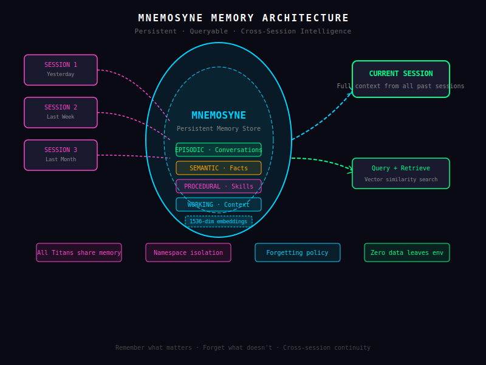

# Mnemosyne Memory — Persistent Cross-Session Intelligence

Large language models are extraordinarily capable — but they share one fundamental limitation: they are stateless. Ask a model a question, get an answer, and then close the session. The model has no memory of the interaction. Start a new session, and you are back to square one. Every conversation is an island, disconnected from the ones that came before.

This is not a minor inconvenience. It is a fundamental barrier to building AI systems that are genuinely useful over time. A customer support AI that forgets what a user asked yesterday cannot provide continuity of service. A coding assistant that forgets your project's conventions cannot give relevant suggestions. A personal AI assistant that forgets your preferences is just a stranger wearing your name.

Zeus solves this with **Mnemosyne** — a persistent, queryable, cross-session memory system that gives every Titan in your fleet the ability to remember, learn, and grow.



Named after the Greek goddess of memory, Mnemosyne is not a simple cache or conversation log. It is a sophisticated memory architecture built around how humans actually retain and recall information.

## 1. The Memory Problem

The stateless nature of LLMs is a consequence of how they are trained. A model is trained on a massive corpus of text, developing statistical relationships between words and concepts. These relationships are fixed at training time. When you interact with the model, you are just navigating the vast space of what it already learned during training.

This creates several practical problems:

**Knowledge cutoff**: Every model has a training cutoff date. Ask it about events after that date, and it either guesses or admits ignorance. Worse, it cannot learn from your private data — your company's internal documents, your personal notes, the specific context of your project — because that information was not in its training set.

**No conversation continuity**: In a single conversation, a well-designed prompt can give the model enough context to maintain coherence. But between conversations, there is no mechanism for the model to retain what it learned. A 10-minute conversation about your architecture produces no lasting knowledge that benefits the next conversation.

**Generic responses**: Without memory of the user, the model responds to every user the same way. It does not know that you prefer concise answers or that your colleague wants detailed explanations with examples. Every response is calibrated for an average that suits no one.

**No task persistence**: Complex tasks that span multiple sessions require the user to re-explain the context every time. "Remember that project we discussed last week?" is not a question a well-designed AI should need to hear.

### How Zeus Solves This

Mnemosyne is Zeus's answer to the memory problem. It operates alongside the LLM, not inside it, which means:

- It does not alter the model's weights or capabilities
- It works with any LLM provider — no fine-tuning required
- It is queryable in real time, not just during training
- It persists across sessions, restarts, and Titan upgrades

When a Titan processes a request, Mnemosyne is queried automatically. Relevant memories are retrieved and injected into the prompt context, giving the model the information it needs to provide a contextual, continuity-aware response. When a Titan produces a result worth remembering, Mnemosyne stores it for future use.

### Vector Embeddings and Similarity Search

The key technology enabling Mnemosyne is **vector embeddings**. When a piece of information is stored in Mnemosyne, it is transformed into a high-dimensional numerical vector — a list of hundreds or thousands of floating-point numbers that captures the semantic meaning of the text.

This transformation is performed by an **embedding model** (configurable, defaulting to OpenAI's `text-embedding-3-small` or Minimax's embedding API). The resulting vector is stored alongside the original text and its metadata in the vector store.

The magic of vector embeddings is **semantic similarity**. Two pieces of text with similar meanings — even if they use completely different words — will produce vectors that are close to each other in the high-dimensional space. "I prefer short responses" and "concise replies work best for me" are semantically similar even though they share almost no words. Vector similarity search finds the closest matches to your query, regardless of how the query is phrased.

This means Mnemosyne is not just a keyword search system. You can ask "what did we decide about the database?" and find memories stored as "the Postgres migration was approved last Tuesday" — without the words "database," "decided," or "decided" appearing in the query.

### Different Memory Types

Not all memory is the same, and Mnemosyne reflects this. It distinguishes between four distinct memory types, each serving a different cognitive function:

- **Semantic memory**: Facts, knowledge, and learned information
- **Episodic memory**: Specific past events and conversation histories
- **Procedural memory**: Skills, workflows, and learned behaviors
- **Working memory**: Active context from the current session

This distinction matters because different types of memory are stored, retrieved, and forgotten differently. Semantic memories are general-purpose facts. Episodic memories are time-stamped events. Procedural memories are action sequences. And working memory is transient — gone when the session ends unless explicitly consolidated.

## 2. Vector Embeddings & Semantic Search

Mnemosyne's memory is built on a foundation of vector embeddings and similarity search — the technology that makes it possible to find relevant information without exact keyword matches.

### Everything Is Embedded

Every piece of information that enters Mnemosyne is embedded. This includes:

- **User messages**: The full text of every message a user sends, embedded and stored with sender metadata
- **Titan responses**: Every response a Titan generates, stored as a potential memory for future reference
- **Documents**: Files uploaded to Zeus — PDFs, markdown, code files, spreadsheets — are chunked, embedded, and stored
- **Artifacts**: Generated content (reports, code, emails) that the user confirms or edits is stored as learned knowledge
- **System observations**: Zeus can be configured to automatically observe and remember facts about the environment — file contents, system state, user preferences

The embedding process chunks long documents into overlapping segments (configurable size, defaulting to 512 tokens with 50-token overlap). This ensures that relevant passages are found even when the exact match is in the middle of a long document.

### Semantic Similarity Search Across Full History

When a query is made to Mnemosyne, the query text itself is embedded, and a **similarity search** is performed against all stored vectors. Mnemosyne returns the top-N most similar memories, ranked by cosine similarity (or dot product, depending on the embedding model normalization).

For example, if you ask "what were the action items from the design review?", Mnemosyne searches across all four memory types:

- Semantic memories matching "design review action items"
- Episodic memories about past design review meetings
- Procedural memories about how design reviews are typically run
- Working memory from recent sessions that might mention the review

The results are merged, deduplicated, ranked by relevance, and returned. The Titan then uses these results to construct a contextual response.

### Weaviate or In-Process Vector Store

Mnemosyne supports two vector store backends:

**Weaviate** (recommended for production): An open-source vector database that runs separately from Zeus. Weaviate provides:

- Horizontal scalability via clustering
- Hybrid search (combining vector similarity with BM25 keyword search)
- CRUD operations with automatic index updates
- Multi-tenancy for isolating memory namespaces per Titan or per user
- GraphQL and REST APIs that Mnemosyne connects to

**In-process vector store** (for single-node deployments): A lightweight embedded vector database (using the `qdrant` embedded library or similar) that runs within the Zeus process. This is ideal for smaller deployments, testing, or situations where you do not want to run a separate database service. It uses the same vector storage format, so migrating to Weaviate later is straightforward.

Both backends share the same Mnemosyne API, so skills and Titan prompts remain agnostic to the underlying storage technology.

### Configurable Embedding Model

The embedding model is fully configurable in `config.toml`. You can choose from:

- **OpenAI**: `text-embedding-3-small` (1536 dimensions, fast, cheap) or `text-embedding-3-large` (3072 dimensions, higher quality)
- **Minimax**: Minimax's embedding API with competitive quality and pricing
- **Cohere**: Cohere Embed v3 and v3.5 models
- **Local models**: Any Ollama-hosted embedding model (e.g., `nomic-embed-text`) for fully offline operation

The embedding model affects both storage (how vectors are generated) and retrieval (how queries are embedded). Consistency between storage and retrieval models is enforced — you cannot search with one model against vectors stored by another.

Embedding dimension limits can be configured to truncate high-dimensional embeddings to lower dimensions, reducing storage and search cost at the expense of some semantic fidelity.

## 3. Memory Types

Mnemosyne's architecture mirrors cognitive science's understanding of how human memory works. Each type of memory serves a distinct purpose and has different persistence and retrieval characteristics.

### Semantic Memory: Facts, Knowledge, Learned Information

**Semantic memory** is the memory of facts and knowledge — the "what" of experience. When Zeus learns that "user jane prefers email for urgent notifications," that fact is stored as a semantic memory. When it learns that "the staging environment uses PostgreSQL 15," that too is semantic memory.

Semantic memories are:

- **Time-neutral**: They do not inherently carry a timestamp (though they can be tagged with creation dates)
- **General-purpose**: They can be applied across many different contexts
- **Composable**: Multiple semantic memories can be combined to form new knowledge

When a semantic memory is retrieved, it is returned as a plain statement of fact that the Titan can incorporate into its reasoning. The retrieval system also returns a confidence score — how strongly the stored memory matches the query — allowing the Titan to weight facts appropriately.

Semantic memories can be marked as **verified** (manually confirmed by a user) or **inferred** (automatically derived by the Titan). Inferred memories carry lower confidence until verified, and the Titan can be configured to express uncertainty when relying on inferred knowledge.

### Episodic Memory: Past Events, Conversation Histories

**Episodic memory** captures specific events — the "what happened" of experience. Every significant interaction, every completed task, every decision made is recorded as an episodic memory with full temporal context.

An episodic memory entry includes:

- **Event description**: A natural-language summary of what happened
- **Timestamp**: When the event occurred (UTC)
- **Participants**: Who was involved (user IDs, Titan IDs)
- **Outcome**: What resulted from the event (success, failure, partial)
- **Related memories**: Links to semantic and procedural memories that are contextually relevant

Episodic memories enable Zeus to answer questions like "what did we discuss last time about the deployment pipeline?" or "have we tried using Redis for caching before?" The Titan retrieves relevant episodes, reconstructs the context, and provides a coherent answer.

Episodic memories are automatically summarized and consolidated during off-peak hours. Long conversation histories are distilled into condensed summaries that preserve key facts and decisions while reducing storage cost. Original detailed logs are archived and retrievable on demand.

### Procedural Memory: Skills, Workflows, Patterns

**Procedural memory** captures how to do things — the "how" of experience. When Zeus learns a complex workflow, it stores the steps as a procedural memory. When it discovers a pattern (e.g., "when the error log shows OOM, the first step is to check the pod resource limits"), that pattern is stored procedurally.

Procedural memories are stored as **structured action sequences** — lists of steps, conditionals, and expected outcomes that the Titan can replay when a similar situation arises. Unlike semantic memories (which are facts) or episodic memories (which are events), procedural memories are **programs** — knowledge encoded as actionable instructions.

This is particularly powerful for automating complex, multi-step processes. A Titan that learns "how to set up a new microservice in our environment" from watching you do it once can then reproduce that process autonomously. The procedural memory captures not just the commands, but the decision logic: when to use which database, how to name the service, what files to create, how to configure the CI/CD pipeline.

Procedural memories are versioned. When a workflow changes, the new version is stored alongside the old one, with a deprecation date. Titans always use the current version unless specifically asked to fall back.

### Working Memory: Current Session Context

**Working memory** is the short-term memory of the current session. It holds everything that is currently relevant but not yet committed to long-term storage:

- The current conversation history
- Active tasks and their current state
- Recently retrieved long-term memories (kept hot for fast access)
- Temporary variables and scratchpad notes

Working memory is fast (in-process, no serialization) and high-capacity (limited only by the LLM's context window). It is automatically flushed to episodic memory at the end of a session, with selective facts promoted to semantic memory if the Titan determines they are worth retaining long-term.

Working memory is also where **context compression** happens. If a session becomes very long, older turns are periodically summarized and condensed to free up context space. The summary is accurate enough to preserve key facts while reducing the token footprint.

## 4. Recall System

Storing memories is only half the challenge. The other half is retrieving the right memories at the right time, with the right relevance weighting. Mnemosyne's recall system handles this.

### Automatic Relevance Scoring

Every memory retrieval goes through a **relevance scoring** pipeline. The pipeline evaluates each candidate memory on multiple dimensions:

- **Semantic similarity**: How close is the memory's embedding to the query's embedding? This is the primary signal.
- **Recency**: When was the memory created or last accessed? Recent memories are weighted higher.
- **Access frequency**: How often has this memory been retrieved? Frequently accessed memories are considered more important.
- **User confirmation**: Has the user verified or corrected this memory? Verified memories score higher.
- **Contextual relevance**: Does this memory relate to the current conversation's topic and participants?

These signals are combined into a composite relevance score that determines which memories are surfaced. The weighting of each signal is configurable — you can prioritize recency (good for fast-changing domains) or frequency (good for stable knowledge bases).

### Time-Decay Weighting

Human memory is not static — recent experiences are more accessible than old ones. Mnemosyne implements **time-decay weighting** that naturally reduces the relevance score of older memories over time.

The decay function is configurable. The default is an exponential decay with a half-life of 30 days — a memory's recency weight halves every month. You can configure a slower decay for knowledge bases that should be stable long-term, or a faster decay for rapidly changing domains.

Importantly, time-decay affects retrieval weighting, not storage. An old memory is still stored and retrievable — it just scores lower in relevance unless other signals (high semantic similarity, user verification) compensate. A 6-month-old memory about your deployment process is still there and still findable.

### Cross-Session Continuity

The defining feature of Mnemosyne is **cross-session continuity**: Titans remember across sessions, restarts, and upgrades. When a Titan starts a new session, Mnemosyne queries relevant memories based on user identity and conversation context, preloading the Titan with full history.

This continuity applies fleet-wide. A user who established a relationship with the Support Titan last month finds that the DevOps Titan also knows about their preferences, because memories live in shared namespaces. Titans can be configured with private memory namespaces for isolation. Mnemosyne's storage persists independently of the Zeus daemon — restarts and upgrades do not wipe the memory store.

### Forgetting Policy

Knowing what to forget is as important as knowing what to remember. Mnemosyne's **forgetting policy** gives you fine-grained control over retention:

- **Automatic expiration**: Memories can be tagged with an expiration date. After that date, they are automatically deleted. Useful for temporary context ("this sprint's goals") that should not linger indefinitely.
- **Access-based cleanup**: Memories that have not been accessed in a configurable period (default: 90 days) can be automatically archived and then deleted after a secondary period (default: 1 year).
- **Manual forgetting**: Users and operators can explicitly request deletion of specific memories or categories of memories. A DELETE request to the API removes the memory from the vector store and the audit log.
- **Privacy mode**: When privacy mode is enabled for a user, all their memories — semantic, episodic, and procedural — are flagged for non-persistence. They exist in working memory for the session but are never written to the durable store.

Forgetting is logged in the audit trail, providing a complete record of what was remembered and what was forgotten and by whom.

## 5. API Surface

Mnemosyne exposes a clean RESTful API for all memory operations. The API is fully documented in the OpenAPI spec at `/swagger-ui`, but here is an overview of the primary endpoints.

### POST /v1/memory — Store a Memory

Creates a new memory entry. The request body specifies:

```json
{
  "type": "semantic",
  "content": "User prefers dark mode in the IDE",
  "metadata": {
    "user_id": "user_abc123",
    "confidence": "verified",
    "expires_at": null,
    "tags": ["preferences", "ui", "user_abc123"]
  }
}
```

The `type` field accepts `semantic`, `episodic`, `procedural`, or `working`. The content is embedded automatically using the configured embedding model. The response includes the memory ID, embedding dimensions, and storage confirmation.

### GET /v1/memory/search — Semantic Search

Performs a similarity search across all memories. The query parameters include:

- `q`: The search query text (embedded automatically)
- `type`: Filter by memory type (optional)
- `namespace`: Filter by memory namespace (e.g., Titan ID or user ID)
- `limit`: Maximum results to return (default: 10)
- `min_score`: Minimum relevance threshold (default: 0.7)

The response includes ranked results with memory content, metadata, and relevance scores:

```json
{
  "query": "what is the deployment process",
  "results": [
    {
      "id": "mem_xyz789",
      "type": "procedural",
      "content": "To deploy: run ./scripts/deploy.sh staging, then verify health at /health",
      "score": 0.94,
      "metadata": { "created_at": "2024-01-15T10:30:00Z", "tags": ["deployment"] }
    }
  ],
  "total_results": 1,
  "search_time_ms": 12
}
```

### GET /v1/memory/:id — Retrieve a Specific Memory

Fetches a single memory by its ID. Returns the full memory entry including content, metadata, embedding vector, and access statistics (how many times it has been retrieved, when it was last accessed).

### DELETE /v1/memory/:id — Forget a Memory

Permanently deletes a memory from the vector store. The deletion is logged in the audit trail with the actor and reason (if provided). Soft delete is not supported — deletion is final.

### GET /v1/memory/stats — Memory Usage Statistics

Returns aggregate statistics about the memory store:

- Total memory count by type
- Storage size by namespace
- Average embedding dimensions
- Most frequently accessed memories
- Oldest and newest memories
- Forgetting policy impact (memories due for expiration, cleanup candidates)

This endpoint is essential for capacity planning, compliance reporting, and tuning the forgetting policy.

---

Mnemosyne transforms Zeus from a stateless query engine into a persistent, learning intelligence. It remembers what matters, forgets what does not, and gives every Titan in your fleet the continuity and context necessary to be genuinely useful over time. Memory is not a feature — it is the foundation of intelligence.
