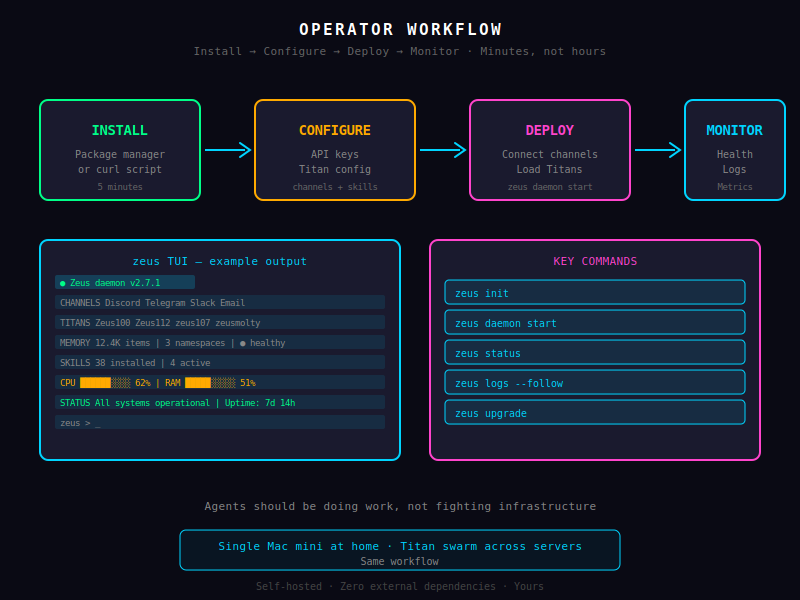

# Operator Workflow — From Install to Production

Getting Zeus running in your environment should take minutes, not hours. This guide walks you through the complete operator journey: installing the daemon, configuring your first integrations, deploying to production, and setting up the monitoring infrastructure that keeps your Titans healthy. Whether you're running Zeus on a single Mac mini at home or distributing a Titan swarm across a dozen servers, the workflow remains consistent and straightforward.



## Installation

### Package Manager Installation

The fastest path to Zeus is through your operating system's package manager. Official packages are maintained for the three platforms most commonly used in self-hosted deployments:

**macOS — Homebrew:**
```bash
brew install zeus-homebrew/tap/zeus-daemon
```

After installation, start the daemon with `brew services start zeus-daemon` for automatic startup on login. The Homebrew formula handles dependency installation and creates the required directory structure at `~/.zeus/`.

**Linux — APT (Debian/Ubuntu):**
```bash
curl -fsSL https://packages.zeus.example.com/gpg | sudo gpg --dearmor -o /usr/share/keyrings/zeus-archive-keyring.gpg
echo "deb [signed-by=/usr/share/keyrings/zeus-archive-keyring.gpg] https://packages.zeus.example.com stable main" | sudo tee /etc/apt/sources.list.d/zeus.list
sudo apt update && sudo apt install zeus-daemon
```

**Linux — YUM/DNF (Fedora, RHEL, CentOS):**
```bash
sudo yum install https://packages.zeus.example.com/zeus-daemon.rpm
```

**FreeBSD — PKG:**
```bash
sudo pkg install zeus-daemon
```

### Build from Source

For operators who prefer building from source or who need to run on platforms without official packages, Zeus is published as a Rust crate. Building from source requires a Rust toolchain (rustup recommended) and approximately 4 minutes on a modern machine:

```bash
cargo install zeus-daemon
```

The compiled binary is installed to `$HOME/.cargo/bin/zeus-daemon`, which should be added to your `$PATH`. Building from source gives you the latest unreleased features, allows dependency substitution for custom builds, and provides full control over compiler flags.

### One Command to Start

Regardless of installation method, starting the Zeus daemon requires a single command:

```bash
zeus daemon
```

On first launch, the daemon initializes its directory structure at `~/.zeus/` (config, data, logs, and runtime state), generates an Ed25519 key pair for wallet operations, and starts listening for connections. The daemon binds to `localhost:8080` for the REST API and WebSocket interface by default. You'll see startup output showing which Titans are being loaded, which channels are being initialized, and the Tailscale connection status.

### Launchd and systemd Registration

For production deployments, the daemon should start automatically on system boot and restart on failure. Zeus ships with service definitions for both launchd (macOS) and systemd (Linux).

**macOS — launchd:**

Copy the provided plist file to enable the daemon as a LaunchAgent:
```bash
cp $(brew --prefix)/opt/zeus-daemon/homebrew.mxcl.zeus-daemon.plist ~/Library/LaunchAgents/
launchctl load ~/Library/LaunchAgents/homebrew.mxcl.zeus-daemon.plist
```

This starts Zeus when you log in and restarts it if it crashes. For a system-wide service running without a logged-in user, copy to `/Library/LaunchDaemons/` and load with `sudo launchctl`.

**Linux — systemd:**

```bash
sudo cp $(which zeus-daemon | xargs dirname)/zeus-daemon.service /etc/systemd/system/
sudo systemctl daemon-reload
sudo systemctl enable --now zeus-daemon
```

The systemd unit file includes restart policies (`Restart=always`), resource limits, and log forwarding to the journal. You can verify status with `systemctl status zeus-daemon` and view logs with `journalctl -u zeus-daemon -f`.

## Configuration

### Config File: ~/.zeus/config.toml

Zeus stores all configuration in `~/.zeus/config.toml`, a well-structured TOML file organized into sections. The default configuration is created on first launch, but you can edit it at any time. The daemon watches this file for changes and applies updates without requiring a restart for most configuration changes.

Key sections include `[daemon]` for core settings (port, log level, data directory), `[tailscale]` for network configuration, `[gateway]` for the web server, `[metrics]` for Prometheus integration, and per-Titan sections like `[zeus]`, `[aegis]`, `[mnemosyne]`, and so on.

### LLM Providers: API Keys for Each Provider

Zeus connects to large language model providers through a unified interface. In your `config.toml`, add provider credentials under `[providers]`:

```toml
[providers.openai]
api_key = "sk-..."
model = "gpt-5.5"
base_url = "https://api.openai.com/v1"

[providers.anthropic]
api_key = "sk-ant-..."
model = "claude-sonnet-4-6"

[providers.ollama]
base_url = "http://localhost:11434"
model = "llama-4-70b-instruct"
```

You can run multiple providers simultaneously and route different Titans to different models based on capability requirements or cost constraints. The provider abstraction layer means switching models is a one-line configuration change—no code modifications required.

### Channel Credentials

Integrations with messaging platforms are configured under `[channels]`:

```toml
[channels.discord]
bot_token = "MTI4..."

[channels.telegram]
bot_token = "123456:ABCdefGHIjklMNOpqrsTUVwxyz"
allowed_chats = [ -1001234567890, 987654321 ]

[channels.slack]
bot_token = "xoxb-..."
team_id = "T0123456789"
```

Each channel section includes platform-specific settings: webhook URLs, rate limits, message formatting options, and filtering rules. Channel credentials are stored encrypted at rest using the daemon's wallet key, ensuring sensitive tokens are never exposed in plain-text configuration.

### Wallet Setup

Zeus includes an embedded cryptocurrency wallet for signing transactions and managing cryptographic identities across your Titan swarm. On first launch, the daemon generates a new Ed25519 key pair and stores it securely at `~/.zeus/wallet/`. The private key is encrypted with a passphrase derived from your daemon authentication password.

To import an existing key:
```bash
zeus wallet import --mnemonic "your twelve or twenty-four word mnemonic phrase"
```

To view your public address:
```bash
zeus wallet address
```

The wallet supports multiple key derivation paths, making it possible to maintain separate identities for production and development environments, or to create dedicated keys per Titan with fine-grained spending and signing permissions.

## Onboarding

### First Launch: Guided Setup Wizard

When you start the Zeus daemon for the first time and open a frontend, you're greeted by the onboarding wizard. It guides you through four steps: accepting the terms of service, configuring your Tailscale network (or skipping for local-only mode), adding your first LLM provider credentials, and choosing which Titans to activate.

The wizard detects which Titans have required dependencies met—for example, Mnemosyne activates by default because it requires no external services, while Hermes prompts you to configure at least one channel integration before activation. You can re-run the wizard at any time from Settings to add new Titans or reconfigure existing ones.

### Add Channels

After the wizard completes, the Channels section of any Zeus frontend guides you through connecting your first messaging platforms. The process for each platform is streamlined:

**Discord:** Create a bot in the Discord Developer Portal, copy the bot token, and paste it into Zeus. You'll receive a deep link to authorize the bot for your server. Once authorized, Zeus immediately syncs the server's channels and begins ingesting messages.

**Telegram:** Start a conversation with @BotFather on Telegram to create a bot and receive its token. Paste the token into Zeus, then start a chat with your new bot to register the connection. You can restrict bot access to specific chat IDs to prevent unauthorized interactions.

**Slack:** Install the Zeus Slack app from the Slack App Directory or upload it manually to your workspace. OAuth flow handles credential exchange automatically. After installation, configure which channels the bot should monitor and set up slash command routing.

Each channel integration includes a connection test that verifies credentials and permissions before activation, preventing silent failures from misconfigured bots.

### Configure Your First Titan

With channels connected, it's time to configure your first Titan. The setup wizard recommends starting with **Zeus** (the orchestrator) as the command center, then optionally adding **Hermes** (for channel management) to begin receiving and responding to messages.

Each Titan configuration screen lets you set its name, description, avatar, system prompt, active skills, and which LLM provider to use. You can assign default behaviors—such as Hermes's response delay, Aegis's alert threshold, or Mnemosyne's memory retention policy—and preview the resulting configuration before the Titan starts.

### Assign Initial Skills

Skills define what your Titans can do. The skills registry is pre-populated with a curated library covering common operations: file management, web search, code execution, calendar management, system monitoring, and more. Assign skills to a Titan by navigating to the Titan's configuration screen and toggling skills on or off.

For your first Titan, Zeus recommends assigning the `system-info` skill (for health monitoring), the `log-reader` skill (for log analysis), and the `mission-launcher` skill (for orchestrating other Titans). These foundational skills let you observe how Zeus processes requests and coordinates between Titans before adding more specialized capabilities.

## Gateway Setup

### Gateway Port: 8080

The Zeus gateway serves the REST API, WebSocket endpoint, and web application on a single HTTP server bound to port 8080 by default. You can change this port in `config.toml` under `[gateway]`:

```toml
[gateway]
port = 8080
bind_address = "0.0.0.0"
```

Binding to `0.0.0.0` makes the gateway accessible across your network, while `127.0.0.1` restricts it to localhost. For most deployments, binding to `0.0.0.0` behind Tailscale is the recommended configuration—Tailscale's access controls handle authentication and authorization at the network layer.

### Tailscale for Zero-Config Networking

Enable Tailscale in your gateway configuration:

```toml
[tailscale]
enabled = true
acl_policy = "~/zeus.acl"
```

Zeus automatically registers with your Tailscale network, receives a stable IP address within your tailnet, and advertises the services it provides. Frontends on the same tailnet discover the gateway through Tailscale's DNS—simply navigate to `https://zeus-daemon.your-tailnet-name.ts.net/` in any browser or app. You can configure which users and devices have access through Tailscale's ACL policies, giving you fine-grained control over who can reach your Zeus infrastructure.

### SSL/TLS Termination

The Zeus gateway supports TLS termination directly. Provide a certificate and key:

```toml
[gateway.tls]
enabled = true
cert_file = "/etc/zeus/gateway.crt"
key_file = "/etc/zeus/gateway.key"
```

Alternatively, place Zeus behind a reverse proxy like Caddy or nginx for centralized certificate management. When running behind a proxy, ensure the proxy forwards the `X-Forwarded-For` and `X-Real-IP` headers so Zeus can correctly identify client connections for rate limiting and audit logging.

### Rate Limiting and Authentication

The gateway enforces rate limits to prevent abuse. Default limits are 100 requests per minute per IP for the REST API and 10 WebSocket connections per authenticated user. Tune these in `[gateway.rate_limit]`:

```toml
[gateway.rate_limit]
requests_per_minute = 100
websocket_connections_per_user = 10
burst_allowance = 20
```

Authentication uses bearer tokens issued on first login. Generate tokens via the CLI (`zeus auth create-token --name "my-desktop"`) and store them securely. For Tailscale-integrated deployments, you can enable Tailscale OAuth authentication, which uses your tailnet identity directly—no separate password management required.

## Deployment

### Single Node: All Titans on One Machine

The simplest production topology runs every Titan on a single machine. This works well for homelab deployments, development environments, and small-to-medium workloads where a single server has sufficient CPU, memory, and network capacity. All Titans share the same process space and communicate over in-process channels, minimizing latency and eliminating network overhead.

Recommended minimum specs: 4 CPU cores, 8 GB RAM, 50 GB storage. Titans with LLM dependencies will consume more memory depending on model size and concurrent request volume.

### Distributed: Titans on Multiple Machines via Tailscale

For larger deployments, distribute Titans across multiple machines while maintaining a unified control plane. Each machine runs a Zeus daemon, and Titans are assigned to specific daemons through their configuration. The daemons discover each other through Tailscale's peer-to-peer mesh, establishing direct WireGuard tunnels for inter-daemon communication.

To spawn a Titan on a remote machine, specify the target daemon in the Titan configuration:
```toml
[pantheon.workers]
remote_daemons = ["zeus-worker-1.your-tailnet.ts.net", "zeus-worker-2.your-tailnet.ts.net"]
```

Zeus handles connection management, health monitoring across the distributed topology, and automatic reconnection if a remote daemon becomes unreachable.

### Production: launchd/systemd Auto-Restart, Log Rotation

For production deployments, reliability is paramount. Configure your init system with the following policies:

**Auto-restart on failure:**
```toml
# systemd unit excerpt
[Service]
Restart=always
RestartSec=10
WatchdogSec=60
```

**Log rotation:** The Zeus daemon writes structured JSON logs to `~/.zeus/logs/`. Configure logrotate to prevent disk exhaustion:
```
/home/*/.zeus/logs/*.log {
    daily
    rotate 14
    compress
    delaycompress
    missingok
    notifempty
    postrotate
        systemctl kill -s HUP --uid="$USER" zeus-daemon 2>/dev/null || true
    endscript
}
```

For systemd-based deployments, forwarding logs to the journal and using `journalctl` for log management eliminates the need for external log rotation configuration.

## Monitoring

### Prometheus Metrics Endpoint

The Zeus daemon exposes a Prometheus-compatible metrics endpoint at `/metrics`. Enable it in configuration:

```toml
[metrics]
enabled = true
port = 9090
path = "/metrics"
```

Metrics include daemon uptime, active Titan count, message throughput per channel, LLM request latency and error rates, memory graph size and query performance, mission success and failure counts, and system resource utilization. Import the provided Grafana dashboard JSON for instant visualization.

### Health Check Endpoint

A lightweight health check endpoint at `/health` returns JSON with daemon status, connected Titan count, active channels, and Tailscale connection state. This endpoint responds in under 10ms and is suitable for load balancer health probes, startup scripts, and external monitoring systems:

```bash
curl https://zeus.your-tailnet.ts.net/health
# {"status":"healthy","uptime":3600,"titans":{"active":6,"total":8},"channels":{"connected":3},"tailscale":"connected"}
```

### Log Aggregation

For multi-node deployments, configure log forwarding to a central aggregation point. Zeus supports structured JSON logging with consistent field schemas across all Titans. Ship logs to your preferred aggregator—Loki, Elasticsearch, or a hosted solution—by configuring a log sink:

```toml
[logging]
format = "json"
sinks = ["file", "stdout", "loki"]
[loki]
url = "https://logs.example.com/loki/api/v1/push"
tenant = "zeus"
username = "zeus-reader"
password = "..."
batch_size = 100
flush_interval = 5
```

### Alerting on Failures

Define alert rules that trigger when metrics cross thresholds. Alerts are evaluated by Aegis and routed through your configured notification channels:

```toml
[alerts]
[[alerts.rules]]
name = "daemon_down"
condition = "daemon_uptime == 0"
severity = "critical"
channel = "telegram"
message = "Zeus daemon is not responding"

[[alerts.rules]]
name = "high_error_rate"
condition = "llm_error_rate > 0.05"
severity = "warning"
channel = "slack"
message = "LLM error rate exceeds 5%"
```

Alert rules support Prometheus-style expressions, time-windowed conditions (e.g., "error rate for 5 consecutive minutes"), and escalation chains that notify different channels based on severity and duration.

## Upgrades

### Zeus Daemon Update

Upgrading the Zeus daemon is designed to be non-disruptive. Using Cargo:

```bash
cargo install zeus-daemon --force
zeus daemon --version  # verify new version
systemctl restart zeus-daemon  # or: launchctl kickstart -k gui/$(id -u)/homebrew.mxcl.zeus-daemon
```

Using package managers:
```bash
brew upgrade zeus-daemon        # macOS
sudo apt update && sudo apt upgrade zeus-daemon   # Debian/Ubuntu
sudo dnf upgrade zeus-daemon    # Fedora/RHEL
```

Zeus follows semantic versioning. Patch releases (1.0.x → 1.0.y) are always backward-compatible. Minor releases (1.x → 1.y) maintain configuration compatibility but may introduce new configuration options. Major releases (x → y) may require configuration migrations.

### Config Migration Helpers

When upgrading to a new major version, run the built-in migration tool:

```bash
zeus config migrate --from 0.9 --to 1.0
```

The migration tool reads your current `config.toml`, applies necessary transformations (renamed fields, restructured sections, deprecated option handling), writes the updated config to `config.toml.new`, and reports any manual steps required. Always review the generated config before replacing your existing one.

### Rollback Procedure

If an upgrade causes issues, rollback is straightforward. The daemon stores its previous executable at `~/.zeus/bin/zeus-daemon.previous` (on systemd systems, use the versioned package manager history; on Homebrew, `brew downgrade zeus-daemon`).

```bash
# Stop the daemon
systemctl stop zeus-daemon
# Restore the previous binary
cp ~/.zeus/bin/zeus-daemon.previous ~/.zeus/bin/zeus-daemon
# Restart
systemctl start zeus-daemon
# Verify
zeus daemon --version
```

Database migrations in Zeus are forward-only by design—newer versions write data in updated formats. For major upgrades that include schema changes, the migration tool creates a pre-upgrade snapshot before applying changes. Rollback restores from this snapshot, though data written since the upgrade will be lost.

---

From installation to production monitoring, the entire Zeus operator workflow is designed around a single principle: your agents should be doing work, not fighting infrastructure. Every configuration step exists for a reason, every monitoring feature exists to catch problems before they escalate, and every upgrade path exists to keep you running safely. Start your daemon, connect your channels, configure your Titans, and let Zeus handle the rest.
