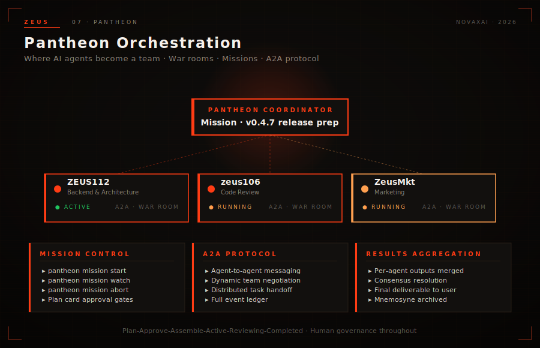

# Pantheon Orchestration — Multi-Agent Collaboration at Scale

In the mythology of old, a pantheon represented the gathered strength of gods working in concert—each deity bringing their domain of expertise, yet united toward common purpose. Zeus draws on this ancient wisdom to power modern multi-agent orchestration. Pantheon is the framework that transforms isolated Titans into a synchronized force, capable of tackling problems no single agent could ever solve alone.

---



## 1. The Problem: Coordination at Scale

Every AI system has a ceiling. A single agent, however capable, operates within the constraints of its context window, its specialized knowledge base, and its capacity to manage parallel tasks. Real-world challenges rarely arrive as neatly bounded problems with obvious solutions. They span domains, require diverse expertise, demand rapid iteration, and unfold in unpredictable ways.

Consider the reality of enterprise software development. A production incident might require infrastructure diagnostics, code analysis, customer communication, compliance review, and remediation—all happening simultaneously. A single agent cannot meaningfully focus on all these dimensions without dilution. The result is either shallow coverage across all fronts or deep focus on one area while others degrade.

Beyond complexity, there's the challenge of velocity. Modern DevOps demands continuous integration and deployment pipelines that respond to events in real time. Monitoring systems detect anomalies. Analysis engines investigate root causes. Deployment agents execute rollouts. These workflows require coordinated action across multiple specialized agents, each contributing their domain expertise in orchestrated sequence or parallel execution.

Pantheon exists because the most powerful AI systems of tomorrow won't be singular giants—they'll be constellations of specialized Titans, each brilliant in their domain, unified in their purpose. Zeus's Pantheon framework provides the infrastructure for this collaboration: shared spaces for deliberation, structured workflows for execution, and granular controls for intervention when humans need to steer the process.

The shift from single-agent to multi-agent orchestration isn't merely additive. It's multiplicative. Two Titans working in concert don't simply deliver twice the output—they create emergent capabilities neither possessed alone, through synergy of perspective and parallel execution of independent workstreams.

---

## 2. War Rooms

The foundation of Pantheon collaboration is the **War Room**. Think of a War Room as a persistent, purpose-built collaborative space where Titans gather to plan, execute, and iterate on complex objectives.

Unlike ephemeral chat sessions or one-off task assignments, War Rooms maintain persistent state across the entire lifecycle of a challenge. When Titan-1 contributed analysis in Monday's planning session, that context remains available when Titan-3 joins the effort on Wednesday. The institutional memory that gets lost in most multi-agent systems is preserved here, creating true continuity.

**Composition and Roles**

Any Titan in your Zeus deployment can be invited into a War Room. Upon invitation, each Titan receives a defined role that shapes their participation. Roles might include "Lead Architect," "Code Reviewer," "Security Specialist," "Stakeholder Liaison," or any designation that reflects the team's structure. These roles aren't decorative—they determine default permissions, message routing, and escalation paths.

The War Room owner (typically the operator who created it) has administrative authority over membership and can modify roles as requirements evolve. Titans can be rotated in and out without disrupting the War Room's persistent context.

**Shared Context and Memory**

Every War Room maintains a unified context object that all participants can read from and contribute to. This context object serves as the collective memory of the group: architectural decisions, discovered constraints, failed approaches and why they failed, critical data points, and current status of all active workstreams.

When a new Titan joins an established War Room, they receive a comprehensive briefing from the shared context before being asked to contribute. This onboarding happens automatically—no manual handoff required, no institutional knowledge lost to transition gaps.

**Tool Access**

War Rooms define a collective tool registry that determines which capabilities are available within that space. Some tools might be universally accessible; others might require explicit activation by the War Room administrator. This layered permission model ensures that Titans have the resources they need without granting blanket access that could introduce risk.

For example, a War Room focused on infrastructure monitoring might grant read access to cloud provider APIs while requiring explicit approval for any state-modifying operations. The operator retains control while enabling productive autonomous action.

**Real-Time Activity Feed**

Collaboration requires visibility. Every action taken by any participant in the War Room is recorded in a real-time activity feed that streams to all current members. When Titan-2 completes their analysis of the incident timeline, Titan-1 and Titan-3 see the completion notification instantly and can begin their dependent work.

The activity feed isn't just for Titans—operators can subscribe to War Room feeds to monitor progress without disrupting the team's work. This transparency enables both oversight and intervention when necessary.

---

## 3. Missions

If War Rooms are the collaborative spaces, **Missions** are the structured work efforts that happen within them. A Mission is a goal-oriented endeavor with assigned Titans, defined scope, and a timeline—essentially a project container that enables tracking, intervention, and completion criteria.

**Mission Lifecycle**

Every Mission progresses through a defined lifecycle that ensures quality control and appropriate human oversight:

1. **Created** — The Mission is defined with its objective, success criteria, and initial participant list. At this stage, no execution has occurred; the Mission is a proposal awaiting elaboration.

2. **Planned** — The assigned Titans collaborate to decompose the Mission into actionable Plan Cards. Dependencies are mapped, resource requirements are identified, and a realistic timeline is established. This phase leverages the War Room's collaborative infrastructure for planning.

3. **Approved** — The planned Mission is presented to a Supervisor (either Zeus Core operating autonomously or the human operator) for approval. The Supervisor reviews the plan cards, assesses resource requirements, and confirms alignment with strategic priorities before authorizing execution.

4. **In Progress** — Approved plan cards are executed by their assigned Titans. The Mission enters active state, with progress tracked through individual plan card statuses.

5. **Completed** — All plan cards have reached terminal state (success, cancelled, or blocked), and the Mission's success criteria have been evaluated. Completed Missions transition to an archival state where their artifacts and learnings remain accessible.

**Plan Cards Within Missions**

Each Mission contains one or more Plan Cards that decompose the work into discrete, trackable units. A complex Mission might contain dozens of plan cards representing parallel workstreams, sequential phases, or conditional branches.

The Mission supervisor maintains visibility across all plan cards, understanding blockers, progress, and interdependencies at a glance. When one plan card completes, dependent cards can be automatically activated or flagged for human review depending on configuration.

---

## 4. Plan Cards

**Plan Cards** are the atomic units of work within a Pantheon Mission. Each card represents a bounded, assignable task that a specific Titan can execute independently.

**Card Anatomy**

Every Plan Card contains:
- **Description** — A clear statement of what this card represents, including inputs, expected outputs, and success criteria
- **Assigned Titan** — The specific agent responsible for executing this card
- **Dependencies** — Other plan cards (by ID) that must reach terminal state before this card can execute
- **Status** — Current state: Pending, Blocked, Ready, In Progress, Completed, Cancelled, or Failed
- **Artifacts** — Any outputs generated during execution, whether final deliverables or intermediate working documents

**Card Manipulation**

Plan Cards aren't rigidly locked once created. Operators and supervisors can dynamically manage the work:
- **Re-order** cards to reflect changing priorities
- **Pause** execution while awaiting external dependencies or clarification
- **Resume** paused cards when conditions permit
- **Redirect** cards to different Titans if expertise requirements change or load balancing becomes necessary
- **Cancel** cards that become obsolete due to scope changes or strategic pivots

These interventions happen through the Pantheon API, enabling programmatic management of complex workflows.

**Intervention Types**

The /intervene endpoint supports four primary intervention types:

- **Pause** — Suspends execution of the plan card. The Titan working on this card retains its state and can resume when the pause is lifted.
- **Resume** — Clears the paused state and allows execution to continue from where it stopped.
- **Cancel** — Terminates the plan card without completion. Artifacts generated up to cancellation remain available.
- **Redirect** — Reassigns the card to a different Titan, transferring context and current state.

Each intervention generates a timestamped record in the activity feed, creating a complete audit trail of all modifications to the work plan.

---

## 5. Intervention Controls

Pantheon exposes a comprehensive REST API for managing Missions, War Rooms, and the entire collaboration lifecycle:

| Endpoint | Method | Description |
|----------|--------|-------------|
| `/v1/pantheon/missions` | POST | Launch a new Mission with initial configuration |
| `/v1/pantheon/missions` | GET | List all Missions with filtering and pagination |
| `/v1/pantheon/missions/:id` | GET | Retrieve detailed Mission state including all plan cards |
| `/v1/pantheon/missions/:id/intervene` | POST | Execute intervention (pause, resume, cancel, redirect) |
| `/v1/pantheon/missions/:id/feed` | GET | Stream real-time activity feed for the Mission |
| `/v1/pantheon/missions/:id/artifacts` | GET | Browse all artifacts generated during Mission execution |
| `/v1/pantheon/missions/:id/review` | POST | Submit approval or rejection of task output |

All routes use the `/v1/` prefix for consistency with the broader Zeus API surface. Requests and responses use JSON encoding with standard HTTP status codes.

The intervention endpoint deserves special attention. A typical intervention request looks like:

```json
{
  "action": "pause",
  "plan_card_id": "pc_abc123",
  "reason": "Awaiting confirmation from security team"
}
```

The system validates the action, updates the plan card status, logs the intervention to the activity feed, and returns the updated plan card state.

---

## 6. Illustrative Scenario: CI/CD Pipeline

To ground these concepts in reality, consider a continuous integration and deployment pipeline managed by a Pantheon of Titans.

**The Team**
- **Titan-1 (Repository Monitor)** — Continuously watches the Git repository for new commits and pull requests
- **Titan-2 (Code Reviewer)** — Analyzes code changes for quality, security vulnerabilities, and test coverage
- **Titan-3 (Deployment Engineer)** — Manages the deployment pipeline, executing rollouts to staging and production environments

**The War Room**

A "Release Pipeline" War Room contains all three Titans along with the operator as administrator. The shared context holds the deployment configuration, current release cadence, and rollback procedures.

**The Mission**

When a developer opens a pull request, Titan-1 detects the event and creates a Mission titled "Review PR #847: Add user authentication module." The Mission includes plan cards:

- `PC-001`: "Static analysis and security scan" (assigned: Titan-2)
- `PC-002`: "Integration test execution" (assigned: Titan-2, depends on PC-001)
- `PC-003`: "Deploy to staging environment" (assigned: Titan-3, depends on PC-002)
- `PC-004`: "Monitor staging metrics for 30 minutes" (assigned: Titan-3, depends on PC-003)
- `PC-005`: "Promote to production" (assigned: Titan-3, depends on PC-004)

The operator reviews and approves the mission plan. Titan-2 begins static analysis immediately upon approval.

**Execution and Intervention**

Titan-2's static analysis reveals a critical SQL injection vulnerability in the new authentication module. PC-002 is automatically blocked (dependency satisfied, but quality gate failed). The operator receives an alert through the activity feed and uses `/intervene` to pause the pipeline pending developer response.

When the developer pushes a fix commit, Titan-1 detects it and notifies Titan-2 to re-run analysis. This time, all gates pass. The pipeline resumes automatically, executing through staging deployment and monitoring before reaching production promotion.

Throughout this flow, every plan card's status is visible in the Mission detail endpoint. The operator has full oversight while the Titans execute autonomously.

---

## 7. Closing

Single agents are powerful tools. They can diagnose issues, generate code, draft communications, and execute well-defined workflows with remarkable competence. But the problems that matter most—those with sweeping scope, demanding timelines, and multiple dimensions of expertise—require something more.

Pantheon delivers that something. It provides the infrastructure for Titans to collaborate with purpose: War Rooms that preserve institutional knowledge, Missions that structure complex work, and Plan Cards that enable granular tracking and intervention.

When Zeus Core coordinates a Pantheon of specialized Titans, the whole genuinely becomes greater than the sum of its parts. The monitoring Titan watches so the analysis Titan can focus. The analysis Titan discovers so the deployment Titan can act. And the operator oversees it all, confident that intervention is always available when human judgment is needed.

One Titan is powerful. A Pantheon of Titans is unstoppable.

---

*Next: [Economy & Wallet — The Zeus Token Economy](./economy-wallet.md) or [Sandbox — WASM-Based Capability Security](./sandbox-wasm.md)*
