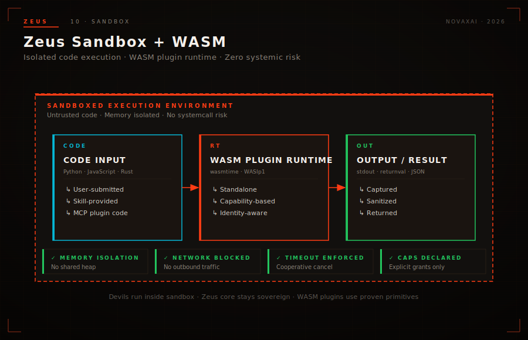

# Sandbox — WASM-Based Capability Security

The power of an extensible AI platform lies in its ability to incorporate new capabilities rapidly. Zeus gains functionality through skills and plugins—often contributed by third parties, sometimes generated by AI systems, occasionally submitted by users who need specialized functionality. This extensibility is a feature, not a bug.

But extensibility introduces risk. Code that runs within the same process as Zeus Core has access to everything Zeus Core has access to: file systems, network connections, environment variables, system calls. A single malicious or buggy skill could compromise the entire platform, exfiltrate sensitive data, or crash the system.



Traditional solutions—process isolation, containerization, virtual machines—introduce unacceptable overhead for high-frequency skill invocations. A Docker container cold start takes seconds; Zeus skills should execute in milliseconds. We needed something faster, lighter, and more granular than containers, with security guarantees that hold even when running untrusted code.

The answer is WebAssembly. Specifically, we built **zeus-sandbox**: a WebAssembly runtime purpose-built for AI agent capability enforcement.

---

## 1. The Problem: Untrusted Code

Every skill that runs on Zeus is, in some sense, untrusted. Even skills developed by trusted team members might contain bugs. Skills downloaded from the community marketplace come from strangers. User-submitted code snippets are, by definition, not audited. AI-generated code might behave in unexpected ways.

Traditional sandboxing approaches each have tradeoffs:

**Process Isolation** — Spawning a separate OS process provides strong isolation but introduces latency (hundreds of milliseconds for process creation and IPC) and memory overhead (each process has its own memory space). For a platform where skills might be invoked thousands of times per minute, this overhead is prohibitive.

**Containerization** — Linux containers offer lightweight isolation with faster startup than VMs, but still require seconds for cold starts and significant memory overhead. They're designed for long-running services, not fine-grained function calls.

**Language-Specific Sandboxes** — Some languages have built-in sandboxing (Java's SecurityManager, Python's restricted execution modes), but these are notoriously difficult to configure correctly and have been deprecated or weakened in recent versions.

**Virtual Machines** — Full VMs provide the strongest isolation but are far too heavy for frequent invocations, requiring gigabytes of memory and minutes to boot.

WebAssembly offers a fourth path: isolation at the function level, with startup times measured in microseconds and memory overhead measured in kilobytes. WASM's security model was designed from the ground up for running untrusted code safely, making it ideal for our use case.

---

## 2. zeus-sandbox: WASM Runtime

zeus-sandbox is Zeus's custom WebAssembly runtime, optimized for the specific requirements of AI agent skill execution: fast startup, deterministic execution, capability-based security, and seamless integration with the broader Zeus platform.

**Why WebAssembly?**

WebAssembly was designed for the browser, but its properties make it equally valuable for server-side sandboxing:

- **Memory Isolation** — WASM modules cannot access memory outside their linear memory space. There is no pointer arithmetic, no buffer overflow exploits, no arbitrary memory read/write.
- **Controlled Execution** — WASM's instruction set is finite and well-defined. Infinite loops can be detected and killed. Execution is deterministic and reproducible.
- **Language Agnostic** — Any language that compiles to WASM (C, C++, Rust, Go, Python via Pyodide, and more) can run in the sandbox. Skills can be written in the language best suited for the task.
- **Verification** — WASM binaries can be statically verified before execution. Security policies can be checked against the module's imports and exports without running the code.

**Runtime Architecture**

zeus-sandbox implements a multi-tenant WASM runtime where multiple sandbox instances coexist in a single process. Each sandbox instance is:

- **Isolated** — No shared memory between instances. Each instance has its own linear memory space.
- **Limited** — Resource limits (memory, CPU time, syscalls) are enforced per-instance.
- **Auditable** — All interactions with the host system are logged for security review.

The runtime manages sandbox lifecycle: instantiation when a skill is invoked, execution of the skill's entry point, and cleanup when execution completes or limits are exceeded.

**Integration with Zeus Core**

When a Titan invokes a skill, Zeus Core coordinates with zeus-sandbox to:

1. Load the skill's WASM module (cached for repeated invocations)
2. Configure the sandbox instance with the skill's approved capabilities
3. Pass inputs to the skill via WASM memory
4. Execute the skill with enforced resource limits
5. Retrieve outputs from WASM memory
6. Return results to the invoking Titan
7. Record execution metrics for billing and debugging

This entire cycle completes in under 5 milliseconds for typical skills, making WASM sandboxing invisible to users while providing security guarantees that containers can't match.

---

## 3. Capability-Based Security

zeus-sandbox implements capability-based security: a security model where rights to perform actions are represented as unforgeable tokens (capabilities) that must be explicitly held to access protected resources.

This contrasts with traditional Unix permission models (user/group/other) or Access Control Lists (which associate permissions with identities). In capability-based systems, possession of the capability is both necessary and sufficient for access. There's no backdoor, no privilege escalation path, no way to access a resource without holding its capability.

**Tool Registry**

The foundation of zeus-sandbox's capability system is the **Tool Registry**—a curated catalog of capabilities that skills can request. Each entry in the registry describes:

- **Capability Name** — Unique identifier (e.g., `network:http:read`, `fs:read:user-data`)
- **Resource Scope** — What the capability grants access to (specific URLs, specific directories, etc.)
- **Risk Level** — Classification to help operators understand implications
- **Audit Requirements** — Whether this capability requires operator approval or can be auto-granted

When a skill is published to Agora or installed locally, it declares which capabilities it requires in its manifest. These declarations are visible to anyone reviewing the skill.

**Capability Grant Flow**

The flow from skill declaration to granted capability:

1. **Declaration** — The skill manifest lists required capabilities (e.g., `fs:read:documents`, `network:http:read`)
2. **Review** — Before first execution, the operator reviews the capability requests
3. **Approval** — The operator approves, modifies, or rejects capability requests
4. **Grant** — Approved capabilities are embedded in the skill's sandbox configuration
5. **Execution** — When the skill runs, it can only access what its granted capabilities allow

This flow ensures that no skill ever receives more privilege than explicitly intended, and that every privilege escalation is a deliberate operator decision.

**Tiered Capability Model**

Capabilities are organized into tiers that reflect their risk profiles:

**Tier 1: Read-Only, Local** — Capabilities that allow reading from limited local resources. Example: `fs:read:cache-dir`. These are generally safe to auto-approve for community skills.

**Tier 2: Read-Write, Local** — Capabilities that modify limited local resources. Example: `fs:write:temp-dir`. Requires moderate scrutiny; most legitimate skills need some write access to temporary storage.

**Tier 3: Network Access** — Capabilities that enable network communication. Example: `network:http:read`. Significantly higher risk; enables data exfiltration if misused. Always requires explicit operator approval.

**Tier 4: System State** — Capabilities that affect system configuration or external services. Example: `system:env:read`, `system:process:spawn`. Highest risk; rarely needed and always scrutinized.

---

## 4. System Call Whitelist

Even within a WASM sandbox, skills might attempt to call host system functions (syscalls) if their WASM code was compiled from a language that normally has syscall access. zeus-sandbox implements an aggressive whitelist approach: all syscalls are blocked by default, and only explicitly whitelisted calls are permitted.

**Network Access**

Outbound network connections are disabled by default. A skill that needs to fetch data from an external API must request and receive the `network:http:read` capability. Even then, the capability is scoped:

- **URL Restrictions** — The capability specifies allowed URL patterns (e.g., `https://api.weather.com/*`). Attempts to access URLs outside the pattern are blocked.
- **Method Restrictions** — The capability can be limited to specific HTTP methods (GET only, or GET and POST).
- **Header Filtering** — Sensitive headers (authentication tokens, cookies) are stripped unless explicitly permitted.
- **Response Size Limits** — Large responses are truncated or rejected to prevent memory exhaustion.

Inbound network access (listening on ports, accepting connections) is never permitted in the sandbox environment.

**File System Access**

The file system is the most commonly requested capability. zeus-sandbox implements directory-scoped access:

- **Designated Directories** — Operators configure specific directories each skill can access. The skill cannot see, read, or write outside these directories.
- **Permission Granularity** — Read and write permissions are separate. A skill might have read-only access to a shared data directory while having read-write access to its own working directory.
- **Path Traversal Prevention** — Symbolic links and path traversal attacks (`../`) are resolved and validated against the permitted scope.
- **Hidden Files** — Dotfiles (`.env`, `.git`) are treated as hidden by default and require explicit capability grants to access.

**Environment Variables**

Environment variables are read-only and filtered:

- **Sensitive Variables Blocked** — Variables containing secrets (API keys, passwords, tokens) are never exposed to sandboxed code.
- **Non-Sensitive Variables Allowed** — Common environment variables (language version, locale settings, timezone) are available to skills that request them.
- **No Writing** — Environment variables cannot be modified within the sandbox, preventing a compromised skill from altering its own execution context.

**Process Spawning**

The most dangerous capability—spawning new processes—is never permitted. Skills cannot:

- Fork new processes
- Execute shell commands
- Spawn additional programs
- Run system binaries

This effectively prevents a compromised skill from escalating to system-level access.

---

## 5. Use Cases

zeus-sandbox's capability-based security enables several important use cases that would be impractical or unsafe without strong isolation:

**Untrusted Third-Party Skills**

The Agora marketplace thrives on community contributions. Developers share skills for everything from sentiment analysis to spreadsheet manipulation to API integrations. With zeus-sandbox, these skills can run safely:

- A community-contributed Slack integration skill can read/write to the designated data directory without accessing other application data
- A data visualization skill can fetch data from whitelisted APIs without transmitting local files
- A document processing skill can operate on user-provided files without network access

Operators can install community skills without manual code review, trusting that the sandbox enforces declared capabilities.

**User-Submitted Code Snippets**

Some Zeus workflows accept code from end users—custom transformations, user-defined rules, AI-generated suggestions. Without sandboxing, executing user code would be an unacceptable security risk. With zeus-sandbox:

- User code runs with the same capability enforcement as official skills
- Malicious code cannot exfiltrate data or compromise the system
- Performance is predictable regardless of code quality

This enables powerful customization features while maintaining security posture.

**Experimental AI-Generated Code**

Modern AI systems can generate functional code—but generated code often contains bugs, security vulnerabilities, or unexpected behavior. zeus-sandbox provides a safety net:

- Generated code runs in the sandbox where bugs can't crash Zeus Core
- Capability restrictions prevent generated code from accessing sensitive resources
- Resource limits prevent infinite loops and memory exhaustion

This enables AI-assisted development workflows where generated code can be safely tested and refined.

**Legacy Tool Wrappers**

Organizations often have legacy scripts and utilities that provide valuable functionality but weren't designed for secure execution. Instead of rewriting these tools, zeus-sandbox can wrap them:

- Legacy Perl scripts, shell scripts, and Python 2 code can run safely in the sandbox
- The wrapper restricts the legacy tool's access to only what's needed
- Updates to the sandbox configuration take effect without modifying the legacy code

This extends the useful life of existing investments while modernizing their security posture.

---

## 6. Performance

zeus-sandbox is engineered for minimal overhead. The security guarantees should be invisible to users and negligible in cost for Titans executing skills.

**Startup Time**

WASM module instantiation is extraordinarily fast:
- **Cold Start**: < 5 milliseconds for module loading and instance creation
- **Warm Start**: < 1 millisecond for cached modules (already loaded)
- **Compiled Caching**: AOT-compiled WASM modules for even faster execution

This contrasts with Docker containers (seconds), lightweight containers like gVisor (hundreds of milliseconds), and even mature WASM runtimes like Wasmtime (tens of milliseconds for cold starts).

**Execution Overhead**

For compute-intensive workloads, WASM execution adds only 1-3% overhead versus native execution:
- Modern WASM JIT compilers generate highly optimized machine code
- The overhead is dominated by capability checks at boundaries, not WASM execution itself
- Most skills are I/O-bound anyway (waiting on network or disk), making the CPU overhead negligible

**Parallelism**

zeus-sandbox supports multiple concurrent sandbox instances:
- Each instance is isolated and independently scheduled
- Multi-core systems can run parallel skills without contention
- Resource limits are enforced per-instance, preventing any single skill from monopolizing resources

**Memory Limits**

Memory consumption is bounded and configurable:
- **Default Limit**: 128 MB per sandbox instance
- **Configurable**: Operators can increase limits for memory-intensive skills
- **Strict Enforcement**: Allocations exceeding the limit are rejected, not truncated
- **Efficient Cleanup**: Memory is released immediately when the sandbox instance terminates

These limits prevent any single skill from consuming excessive memory while allowing legitimate skills to operate on substantial datasets.

---

## 7. API Routes

zeus-sandbox exposes the following endpoints for managing skill execution and capability grants:

| Endpoint | Method | Description |
|----------|--------|-------------|
| `/v1/sandbox/execute` | POST | Execute a WASM module with given inputs |
| `/v1/sandbox/capabilities` | GET | List all available capabilities in the registry |
| `/v1/sandbox/capabilities/:skill` | GET | List capabilities required by a specific skill |
| `/v1/sandbox/approve` | POST | Approve capability grant for a skill |
| `/v1/sandbox/revoke` | POST | Revoke a previously granted capability |
| `/v1/sandbox/status` | GET | Get sandbox health and resource utilization |
| `/v1/sandbox/instances` | GET | List active sandbox instances |
| `/v1/sandbox/instances/:id` | GET | Get details for a specific instance |

**Execute Endpoint**

The primary endpoint for running skills:
```
POST /v1/sandbox/execute
{
  "skill_id": "weather-api-v2",
  "input": { "city": "San Francisco", "units": "metric" }
}
→ { "instance_id": "sbi_abc123", "output": { "temp": 18, "conditions": "partly cloudy" } }
```

The response includes execution metadata: duration, memory consumed, and any capability violations.

**Capability Approval**

Granting a capability to a skill:
```
POST /v1/sandbox/approve
{
  "skill_id": "weather-api-v2",
  "capabilities": ["network:http:read"],
  "scopes": {
    "network:http:read": {
      "url_patterns": ["https://api.weather.com/*"],
      "methods": ["GET"]
    }
  },
  "approved_by": "operator@example.com"
}
→ { "status": "approved", "effective_immediately": true }
```

**Status Endpoint**

Monitor sandbox health:
```
GET /v1/sandbox/status
→ {
    "healthy": true,
    "active_instances": 12,
    "total_memory_mb": 512,
    "memory_used_mb": 384,
    "executions_last_hour": 1847,
    "average_latency_ms": 3.2
  }
```

---

## 8. Security Guarantees

zeus-sandbox provides several security properties that distinguish it from traditional sandboxing approaches:

**Memory Safety** — WASM's linear memory model prevents all memory-safety vulnerabilities: buffer overflows, use-after-free, null pointer dereferences. These are the most common classes of security bugs in C/C++ code; WASM makes them structurally impossible.

**Capability Confinement** — The capability-based security model ensures that even if a skill is compromised, the attacker inherits only the capabilities the skill was explicitly granted. There's no way to escape to additional privileges.

**Deterministic Execution** — WASM execution is deterministic and interruptible. Infinite loops cannot hang the system; runaway code is killed within its resource limits.

**Audit Trail** — Every capability use is logged. If a skill suddenly attempts to access resources it hasn't accessed before, operators are alerted. This supports both security monitoring and debugging.

**No Privilege Escalation** — The sandbox enforces strict hierarchy: WASM modules cannot grant themselves additional capabilities, cannot modify their own sandbox configuration, and cannot interfere with other sandbox instances.

---

## 9. Future Directions

zeus-sandbox continues to evolve with the WebAssembly ecosystem:

**WASI Support** — The WebAssembly System Interface (WASI) provides a standardized API for system-level operations. zeus-sandbox will support WASI capabilities as they're standardized and proven.

**Formal Verification** — For highest-assurance deployments, we're exploring formal verification of the sandbox runtime itself, providing mathematical proofs of isolation guarantees.

**Performance Optimization** — Ongoing work on JIT compilation, memory management, and parallel execution will continue reducing overhead toward zero.

**Broader Language Support** — As more languages gain first-class WASM compilation support (Java, Kotlin, C#), we anticipate expanding the language portfolio for skill development.

---

*Next: [Pantheon Orchestration — Multi-Agent Collaboration at Scale](./pantheon-orchestration.md) or [Economy & Wallet — The Zeus Token Economy](./economy-wallet.md)*
