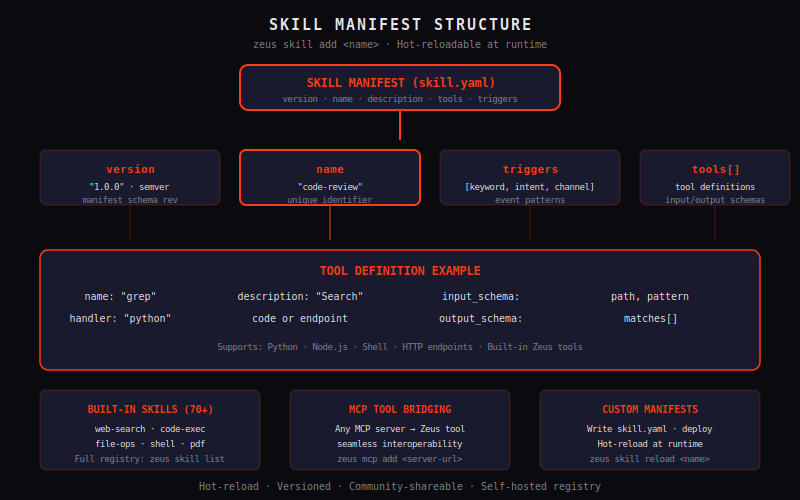

# Skills

*The next generation of Sentient AI entities. The Titans. The future is here.*

---

Skills are how you extend Zeus. A Skill is a structured capability package — a set of tools, prompts, and behaviors that a Titan can load to handle specific tasks. Think of them as apps for your AI agents.

---



## What is a Skill?

A Skill is a directory with a `SKILL.md` manifest and associated resources:

```
~/.zeus/skills/my-skill/
├── SKILL.md          # The skill manifest
├── prompts/         # Custom prompt templates
├── tools/           # Tool definitions
└── resources/       # Static assets
```

The `SKILL.md` format is Zeus's extension system. It defines:
- What the skill does
- What tools it exposes
- How it should behave
- What context it needs

Skills are installed via `zeus skills install <name>` and loaded at runtime by the Titan that needs them.

---

## Installing Skills

```bash
# Browse available skills
zeus skills list

# Install from ClawHub (zeuslab.ai/clawhub)
zeus skills install github-repo-analysis

# Install from URL
zeus skills install https://github.com/your-org/zeus-skill-name

# Install locally
zeus skills install /path/to/my-skill

# List installed skills
zeus skills list --installed

# Update a skill
zeus skills update github-repo-analysis

# Remove a skill
zeus skills remove github-repo-analysis
```

---

## Built-in Skills

Zeus ships with a curated set of skills in the base install:

| Skill | Description | Crate |
|---|---|---|
| `default` | Standard agent behavior | `zeus-skills` |
| `code` | Code writing, review, debugging | `zeus-skills` |
| `research` | Web search, deep research, synthesis | `zeus-skills` |
| `creative` | Writing, brainstorming, ideation | `zeus-skills` |
| `analysis` | Data analysis, chart generation | `zeus-skills` |
| `system-admin` | Server management, logs, diagnostics | `zeus-skills` |
| `voice` | Voice-first interaction | `zeus-voice` |
| `memory` | Memory management and search | `zeus-mnemosyne` |

---

## The SKILL.md Format

Every skill has a `SKILL.md` in its root. Here's a minimal example:

```markdown
---
name: github-repo-analysis
version: 1.0.0
description: Analyze GitHub repositories — structure, code quality, activity
author: ZeusLabs
tags: [code, analysis, github]
---

# GitHub Repo Analyzer

You are an expert at analyzing GitHub repositories. You can:
- Clone and navigate repository structure
- Read files and assess architecture
- Analyze commit history and activity
- Evaluate code quality patterns
- Generate reports

## Tools

You have access to:
- `github.clone(url)` — Clone a repository
- `github.read_file(path)` — Read a file from the repo
- `github.list_dir(path)` — List directory contents
- `github.search(query)` — Search code in the repo
- `github.commits(limit)` — Get recent commits

## Behavior

When given a GitHub URL:
1. Clone the repository
2. Assess the overall structure
3. Look at README, package files, and main source directories
4. Analyze recent commits for activity patterns
5. Report: architecture, quality signals, activity level, any red flags

## Output Format

Always respond with:
- **Summary** — what the repo does in 1-2 sentences
- **Architecture** — key directories and their roles
- **Quality Signals** — test coverage, documentation, CI/CD
- **Activity** — commit frequency, maintainer responsiveness
- **Red Flags** — security issues, dead code, abandoned deps
```

---

## Skill Registry

Skills can be published to ClawHub — Zeus's community skill marketplace:

```bash
# Publish your skill to ClawHub
zeus skills publish my-new-skill

# Search ClawHub
zeus skills search "code review"
zeus skills search "web scraping"

# Install a community skill
zeus skills install clawhub:code-review-gpt
```

---

## OpenClaw Integration

Skills are the bridge to **OpenClaw** — the open agent interoperability standard. Skills can expose their capabilities via the OpenClaw manifest, allowing agents built on other platforms to use Zeus Skills.

The `SKILL.md` format is designed to be OpenClaw-compatible:
- Tool definitions follow OpenClaw's schema
- Capability manifests are portable
- Cross-platform agent collaboration via Agora (agent marketplace)

---

## Custom Skills

Build your own skill in minutes:

```bash
# Scaffold a new skill
zeus skills new my-awesome-skill
# Creates: ~/.zeus/skills/my-awesome-skill/SKILL.md

# Edit the manifest
$EDITOR ~/.zeus/skills/my-awesome-skill/SKILL.md

# Test it
zeus skills test my-awesome-skill

# Install and activate
zeus skills install my-awesome-skill
```

---

## Skills in Pantheon

Skills shine in multi-agent workflows. In Pantheon war rooms, different agents can load different skills:

```
War Room: Website Migration
├── Pantheon (Supervisor) — coordinates the mission
├── Zeus (Planner) — loads "system-admin" skill, creates migration plan
├── Titan A (Frontend) — loads "code" skill, handles HTML/CSS migration
├── Titan B (Backend) — loads "code" skill + "database" skill, handles API porting
└── Mnemosyne — loads "memory" skill, tracks decisions and context
```

Each agent uses exactly the skills it needs. The mission gets done faster with specialized tools.

---

**Previous:** [Configuration →](configuration.md) · **Next:** [Channels →](channels.md)
